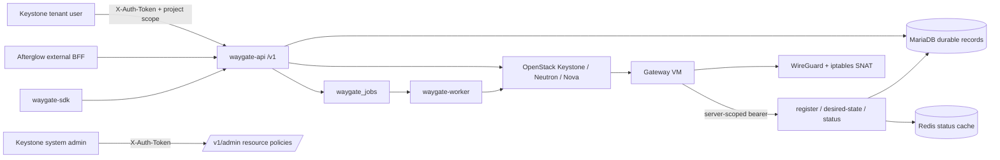

# Waygate Architecture

## Overview

Waygate는 OpenStack 프로젝트별 WireGuard 게이트웨이 VM을 만들고, 게이트웨이 에이전트의 desired state를 관리하며, WireGuard client 설정을 발급하는 독립 서비스다. 서버와 client의 소유권 경계는 Keystone project다. API는 자체 `/v1` 네임스페이스를 제공하고, Afterglow는 필요할 때 외부 BFF로서 이 API를 호출한다. Waygate가 다른 형제 저장소의 private 모듈을 import하지 않는 독립 배포 단위라는 점이 중요하다.

- Repository: [openstack-afterglow/waygate](https://github.com/openstack-afterglow/waygate)
- 분석한 branch: `dev`; 분석한 작업 트리의 소스 기준일은 이 문서 작성 시점이다.
- package versions: root distribution and Python runtime package `waygate` `0.2.0` (`pyproject.toml`, `waygate/__init__.py`, root `uv.lock`); this is the release-candidate version, not yet tagged or published. `waygate-sdk` remains independently versioned at `0.1.2` (`sdk/pyproject.toml`, `sdk/uv.lock`) and is not released with 0.2.0. The packaged Kolla role defaults to `waygate_image_tag: "0.2.0"` for registry images; its source-build checkout stays pinned to the existing immutable commit `1c59b5e86d3c3c1b9d3397b38301ee9bc401cf03` and is not retagged to an uncreated release commit. Package Python `>=3.11` (CI and runtime image use 3.12), FastAPI `0.125.0`, Uvicorn `0.39.0`, OpenStack SDK `3.3.0`, Pydantic `2.13.4`, Redis client `5.0.0`.
- 1분 책임 요약: `waygate-api`는 Keystone 인증·project 소유권·API를, `waygate-worker`는 durable provision/delete job을, MariaDB는 정본 레코드와 암호화 자격증명을, Redis는 관측 상태의 보조 캐시를 소유한다. agent 인증은 매번 DB 정본을 확인하며 Redis token cache를 사용하지 않는다. 실제 WireGuard private key와 NAT 적용은 게이트웨이 VM의 agent가 소유한다.

## Development status

상태와 검증 수준은 서로 다른 축이다. 이전 upstream/release-metadata 결과와 2026-09-26 gateway-mode/rotation candidate의 실제 검증 결과는 아래 Development and verification에 구분해 기록한다. 이 candidate는 로컬 MariaDB/Redis, multi-architecture API/worker, WireGuard, QEMU build/boot 및 실제 OpenStack Nova build → Glance snapshot → 새 VM boot를 실행했다. Commit `fda693a`는 DMSLAB Kolla에 배포되었고, 배포된 API를 통한 cloud-init mode 전체 gateway lifecycle과 probe-VM data plane이 live 통과했다. 2026-09-26 운영 image policy와 Kolla 설정을 prebuilt로 전환한 후 신규 게이트웨이 lifecycle이 별도로 live 통과했다. 새 client 설정·PSK·트래픽 기능은 아직 운영에 배포하지 않았다. 이 기능들과 이후 commit을 묶은 `0.2.0`은 candidate for release, not deployed to production 상태이며 tag·image·wheel 발행 전이다.

| 기능 | Implementation | Verification evidence | Current limit | Source |
|---|---|---|---|---|
| project-scoped server 생성·조회·삭제 요청 | implemented | `live-passed` (DMSLAB 2026-09-26, cloud-init) | 생성/삭제는 비동기이며 API는 작업 완료를 기다리지 않는다. | [`waygate/api/servers.py`](waygate/api/servers.py), [`waygate/services/jobs.py`](waygate/services/jobs.py) |
| resource policy 선택과 생성 시점 snapshot | implemented | test-defined | 필수 정책이 없거나 실행 scope에서 검증되지 않으면 생성 요청이 실패한다. | [`waygate/services/resource_policies.py`](waygate/services/resource_policies.py), [`waygate/models/orm.py`](waygate/models/orm.py) |
| Nova/Neutron 게이트웨이 VM provisioning | implemented | `live-passed` (DMSLAB 2026-09-26, cloud-init) | Image-backed boot: zero-disk flavors require the service user's Nova admin role in the tenant project. | [`waygate/services/provisioner.py`](waygate/services/provisioner.py), [`waygate/services/openstack_ops.py`](waygate/services/openstack_ops.py) |
| VM agent register·desired-state·status | implemented | `live-passed` (DMSLAB 2026-09-26, cloud-init) | Shared Python agent reads `/etc/waygate/agent.json`; VM owns keys and WireGuard/NAT commands. | [`waygate/api/agent.py`](waygate/api/agent.py), [`waygate/agent/waygate_agent.py`](waygate/agent/waygate_agent.py) |
| WireGuard client 생성·수정·soft-delete·`.conf` 재다운로드 | implemented | `live-passed` (DMSLAB 2026-09-26) | client private key는 서버 VM으로 보내지지 않으며 `.conf` 응답은 호출 시 평문이다. | [`waygate/api/clients.py`](waygate/api/clients.py), [`waygate/services/config_render.py`](waygate/services/config_render.py) |
| Client DNS/MTU/keepalive, automatically generated PSK, and peer traffic status | implemented in 0.2.0 candidate source | focused tests and isolated local kernel WireGuard/BFF/browser proof passed (2026-09-26/27) | New clients get independent encrypted PSKs; existing clients are not silently rotated. Redis reports are observational, not durable usage history; client RX/TX reverses gateway peer TX/RX. This candidate is not deployed to DMSLAB. | [`waygate/models/schemas.py`](waygate/models/schemas.py), [`waygate/api/clients.py`](waygate/api/clients.py), [`waygate/services/config_render.py`](waygate/services/config_render.py), [`waygate/migrations/003_client_tunnel_settings.sql`](waygate/migrations/003_client_tunnel_settings.sql) |
| 추가 네트워크 attach/detach 및 SNAT | implemented | `live-passed` (DMSLAB 2026-09-26, probe tunnel/target ping) | SNAT만 지원한다. Hot-plugged NIC는 DHCP로 주소를 받으므로 DHCP가 동작하는 subnet이 필요하다. import는 network attachment를 다시 만들지 않는다. | [`waygate/api/attachments.py`](waygate/api/attachments.py), [`waygate/services/network.py`](waygate/services/network.py), [`tests/test_live_waygate_lifecycle.py`](tests/test_live_waygate_lifecycle.py) |
| export/import migration bundle | partial | focused tests and isolated local authenticated API round trip passed (2026-09-27) | Passphrase-wrapped client keys, PSK and tunnel settings transfer without changing the private key/PSK; network reconnection remains manual. | [`waygate/api/migration.py`](waygate/api/migration.py), [`waygate/services/migration.py`](waygate/services/migration.py) |
| admin resource-policy catalog | implemented | test-defined | system-admin Keystone 권한이 필요하다. | [`waygate/api/resource_policies.py`](waygate/api/resource_policies.py), [`waygate/auth.py`](waygate/auth.py) |
| API health/discovery | implemented | test-defined | `/v1/health`는 process-only 응답이며 DB, Redis, OpenStack readiness를 확인하지 않는다. | [`waygate/main.py`](waygate/main.py), [`tests/test_waygate_feature_flag.py`](tests/test_waygate_feature_flag.py) |
| Operator-selected cloud-init/prebuilt agent mode | implemented | cloud-init and prebuilt `live-passed` (DMSLAB 2026-09-26) | Mode is snapshotted per server. Prebuilt selection requires public/community Glance image property `waygate_agent=prebuilt`. Existing cloud-init gateways retain their image and mode. | [`waygate/config.py`](waygate/config.py), [`waygate/services/resource_policies.py`](waygate/services/resource_policies.py) |
| Tenant-triggered agent token rotation | implemented | `live-passed` (DMSLAB 2026-09-26) | Current bearer remains valid until first use of the pending bearer; no overlap deadline. | [`waygate/services/agent_auth.py`](waygate/services/agent_auth.py), [`waygate/api/servers.py`](waygate/api/servers.py) |
| Ubuntu 24.04 amd64 gateway image tooling | implemented | QEMU and native OpenStack build/boot verified | Native fixed-IP SSH verified on `private_provider`; floating-IP path is configuration-tested only. Full Waygate lifecycle is separate. Not part of CI. | [`deploy/image/packer/`](deploy/image/packer/), [`deploy/image/packer/openstack/`](deploy/image/packer/openstack/), [`scripts/build_gateway_image.sh`](scripts/build_gateway_image.sh) |

## System context



텍스트 흐름은 다음과 같다. 테넌트가 project-scoped Keystone 요청으로 서버를 생성하면 API가 현재 admin resource policy를 OpenStack에서 검증하고 snapshot을 MariaDB의 server/job transaction에 고정한다. worker는 gateway VM에서 도달 가능한 명시적 public callback base URL을 검증한 뒤 job을 lease하여 Neutron provider port·security group과 Nova VM을 만든다. VM cloud-init이 자기 WireGuard key를 만든 뒤 server-scoped bearer로 register한다. 추가 네트워크 연결은 선택한 subnet으로 `fixed_ips`를 제한한 Neutron port를 먼저 만들고 그 port ID를 Nova server interface에 붙인다. 이후 VM timer가 `/agent/desired-state`를 폴링하여 peer와 NAT를 적용하고 `/agent/status`로 관측값을 보낸다. Afterglow는 이 API의 외부 BFF일 뿐이고, Drover·Lumen·Palimpsest는 Waygate 내부 상태의 소유자가 아니다.

## Code map

| 경로 | 핵심 심볼 | 책임과 의존 방향 |
|---|---|---|
| [`waygate/main.py`](waygate/main.py) | `app`, `lifespan`, `health` | FastAPI lifespan에서 DB/cache를 열고 닫으며 `/v1` 라우터, discovery, process health를 마운트한다. Uvicorn의 `ProxyHeadersMiddleware`가 설정된 proxy에서 온 scheme/client 주소만 정규화한다. |
| [`waygate/cache.py`](waygate/cache.py), [`waygate/rate_limit.py`](waygate/rate_limit.py) | `close_cache`, `limiter` | 고정된 Redis 5.0.0의 async `close()`로 연결을 닫고, rate limit은 proxy middleware가 정규화한 client 주소를 사용한다. |
| [`waygate/auth.py`](waygate/auth.py) | `require_token`, `require_admin`, `validate_token`, `get_admin_connection_for_project` | Keystone `X-Auth-Token`을 검증하고 project-scoped OpenStack connection을 만든다. |
| [`waygate/worker.py`](waygate/worker.py) | `serve`, `main` | DB를 초기화한 뒤 `process_one_job()`을 반복하는 독립 worker 프로세스다. |
| [`waygate/api/servers.py`](waygate/api/servers.py) | `create_waygate_server`, `delete_waygate_server_endpoint`, `rotate_waygate_agent_token`, `_merge_status` | project 소유권과 API 응답을 담당하고 resource snapshot을 job enqueue에 넘기며 ACTIVE server의 token handoff를 요청한다. |
| [`waygate/api/agent.py`](waygate/api/agent.py) | `_verify_and_bind`, `register_waygate_agent`, `get_desired_state`, `report_waygate_status` | 사용자 JWT가 아닌 server-scoped agent bearer를 검증하고 VM control channel을 제공한다. |
| [`waygate/api/clients.py`](waygate/api/clients.py) | `create_waygate_client`, `list_waygate_clients`, `update_waygate_client`, `download_vpn_client_config`, `_merge_client_status` | Per-project issue/edit/download, generated encrypted PSK, and one cached agent report per client listing; no key material in list responses. |
| [`waygate/api/attachments.py`](waygate/api/attachments.py) | `attach_waygate_network`, `detach_waygate_network` | project-scoped 네트워크 추가 연결과 분리를 노출한다. |
| [`waygate/api/migration.py`](waygate/api/migration.py) | `export_waygate_server`, `import_waygate_server` | passphrase bundle export/import API다. |
| [`waygate/api/resource_policies.py`](waygate/api/resource_policies.py) | `list_resource_policies`, `discover_resource_policy_options`, `update_resource_policy` | system-admin 전역 resource selection 관리 API다. |
| [`waygate/services/jobs.py`](waygate/services/jobs.py) | `enqueue_*_job`, `_claim_one`, `process_one_job` | MariaDB transaction, `SELECT ... FOR UPDATE SKIP LOCKED`, lease/retry, project-scoped delete terminal-state 확인을 구현한다. |
| [`waygate/services/provisioner.py`](waygate/services/provisioner.py) | `provision_waygate_server`, `delete_waygate_server`, `_rollback` | VM-reachable callback URL을 fail-closed 검증하고 persisted snapshot으로 Nova/Neutron lifecycle을 조정한다. 생성 rollback은 best-effort이며 삭제는 VM/FIP/explicit port 정리 실패를 durable retry로 전파한다. |
| [`waygate/services/openstack_ops.py`](waygate/services/openstack_ops.py) | `cleanup_instance_fips`, `wait_server_deleted`, `delete_port` | 실제 cloud 삭제/대기를 담당한다. FIP discovery/delete 실패를 전파하고 선행 disassociate 없이 삭제해 실패한 FIP가 다음 시도에도 발견되게 한다. |
| [`waygate/services/store.py`](waygate/services/store.py) | `waygate_db` CRUD, `get_server_deletion_state` | project filtering, parent-row admission locks, terminal tombstone과 client 비활성화·키 삭제·attachment 정리를 하나의 transaction으로 처리한다. |
| [`waygate/services/agent_auth.py`](waygate/services/agent_auth.py) | `issue_report_token`, `request_token_rotation`, `verify_report_token`, `store_status_result` | DB 정본의 암호화된 current/pending agent token, 조건부 first-use promotion, 별도의 Redis status cache를 담당한다. |
| [`waygate/services/config_render.py`](waygate/services/config_render.py) | `render_client_conf`, `render_agent_desired_state`, `render_agent_userdata` | client config, agent JSON, Nova cloud-init userdata를 렌더한다. |
| [`waygate/services/network.py`](waygate/services/network.py) | `attach_network`, `detach_network` | subnet-constrained port 생성 → port-ID Nova attach → attachment row 활성화를 조정한다. 실패 시 port/row를 rollback하며 detach는 생성 중인 attachment를 409로 거절하고 interface/explicit port를 함께 정리한다. |
| [`waygate/services/resource_policies.py`](waygate/services/resource_policies.py) | `resolve_policy_snapshot`, `set_policy` | public/community image, public flavor, shared/external network 정책을 발견·검증한다. |
| [`waygate/services/migration.py`](waygate/services/migration.py) | `export_bundle`, `import_bundle` | Passphrase wrapping and client/network bundle conversion including PSK and per-client DNS/MTU/keepalive, without recreating attachments. |
| [`waygate/models/orm.py`](waygate/models/orm.py) | `WaygateServer`, `WaygateClient`, `WaygateNetworkAttachment`, `WaygateJob`, `ResourcePolicy` | MariaDB durable schema와 project/server 관계, 상태, 암호문 필드를 정의한다. |
| [`waygate/agent/`](waygate/agent/) | `waygate_agent.py`, `packages.txt`, `install.sh`, units/sysctl | Single-source stdlib agent and runtime dependencies. Cloud-init writes these assets; image builder installs the same files. |
| [`waygate/templates/waygate_agent.yaml.j2`](waygate/templates/waygate_agent.yaml.j2) | per-server config and boot commands | Both modes write root-only agent JSON; cloud-init mode additionally installs packages and assets. |
| [`waygate/migrations/`](waygate/migrations/) | `001_baseline`, `002_agent_install_mode_and_token_rotation`, `003_client_tunnel_settings` | Checksum-verified DDL; 003 adds nullable MTU and non-null keepalive defaulting to 25 for existing clients. [`manifest.txt`](waygate/migrations/manifest.txt) fixes immutable identities. |
| [`deploy/image/packer/`](deploy/image/packer/), [`deploy/image/packer/openstack/`](deploy/image/packer/openstack/), [`scripts/build_gateway_image.sh`](scripts/build_gateway_image.sh), [`scripts/upload_gateway_image.sh`](scripts/upload_gateway_image.sh) | QEMU/native OpenStack build selection, shared provisioning, manifest/metadata, optional QCOW2 upload | Both builders install the same Ubuntu amd64 agent assets. Native OpenStack uses a temporary Nova VM/keypair and produces a Glance image with required properties; QEMU produces a local QCOW2 for separate upload. |
| [`sdk/waygate_sdk/proxy.py`](sdk/waygate_sdk/proxy.py) | `Proxy` | OpenStack SDK service proxy로 `/v1/servers`, client, network, migration, admin policy API를 호출한다. |
| [`sdk/waygate_sdk/service.py`](sdk/waygate_sdk/service.py) | `WaygateService` | service type `waygate`, version `1`과 `Proxy`를 SDK에 등록한다. |
| [`deploy/kolla/ansible/roles/waygate/`](deploy/kolla/ansible/roles/waygate/) | Kolla-Ansible role | root `waygate` wheel의 shared-data로 `share/kolla-ansible/ansible/roles/waygate`에 설치된다. Kolla-Ansible은 이 distribution의 의존성이 아니다. |

의존 방향은 `api → services → db/ORM 또는 OpenStack`이고, `worker → services`다. `sdk`는 HTTP API client이며 서버 runtime의 내부 모듈을 import하지 않는다.

## Runtime flows

### 서버 생성, agent handoff, 상태

1. `POST /v1/servers`의 `require_token`이 `X-Auth-Token`을 Keystone에 검증하고 project를 결정한다.
2. `resolve_policy_snapshot()`이 `waygate.provider_network`, `waygate.image`, `waygate.flavor`를 현재 execution scope에서 재검증하고 선택적으로 `waygate.floating_network`을 읽는다.
3. `enqueue_provision_job()`은 `WaygateServer(status=CREATING, resource_policy_snapshot=...)`와 `WaygateJob(kind=provision,status=queued)`를 한 MariaDB transaction에 기록한 뒤 201을 반환한다.
4. `waygate-worker`의 `_claim_one()`은 queued 또는 900초 이상 stale running job을 `SKIP LOCKED`로 lease한다. `process_one_job()`은 최대 3회 시도하며 실패하면 재queue하거나 server/job을 failed로 만든다.
5. `provision_waygate_server()`는 `waygate.callback_base_url`이 절대 HTTP(S) URL이며 `localhost`, `.localhost`, loopback/unspecified IP가 아닌지 먼저 검증한다. API/worker startup도 같은 검사를 실행하고 빈 값이나 VM에서 도달할 수 없는 loopback 값을 서비스 내부 DNS로 자동 변환하지 않는다. 검증 뒤 provider port, UDP ingress security group, server-scoped encrypted bearer, Nova VM을 만든다. VM이 ACTIVE가 되면 FIP 또는 fixed IP를 기록하고 `PROVISIONING`으로 남겨 register를 기다린다.
6. Both modes write `/etc/waygate/agent.json` mode `0600` with callback URLs, bootstrap bearer, listen port, tunnel CIDR/address, and install mode. `cloud-init` also installs packages and shared assets; `prebuilt` relies on the selected image. The Python `register` command creates VM-only WireGuard keys and `wg0.conf` with `Address = <first tunnel host>/<prefix>`, starts WireGuard, then sends public key and listen-port confirmation. Successful registration transitions CREATING/PROVISIONING to ACTIVE. A failed registration is logged; reconcile does not retry registration.
7. The shared systemd timer starts after 20 seconds and reconciles every 15 seconds. Reconcile reloads JSON, pulls desired peers/NAT, persists any pending bearer before using it, runs `wg syncconf` and SNAT, then reports peers and `agent_source`. Source is `prebuilt` when `/etc/waygate/image-info.json` exists, otherwise `cloud-init`. Redis status TTL remains five minutes.
8. 삭제는 `DELETE /v1/servers/{server_id}`에서 server를 `DELETING`으로 바꾸고 중복 active delete job을 막는다. worker는 FIP/VM/provider 및 explicit attachment port를 정리한 뒤 하나의 DB transaction에서 server를 `DELETED`로 soft-delete하고 agent credentials를 지우며, 모든 client를 비활성화·soft-delete하고 private/preshared ciphertext와 unique 슬롯을 비운다. 정리된 attachment row도 같은 transaction에서 삭제한다. 진행 중인 attachment나 남은 port는 terminal 전이를 막는다. worker는 숨겨진 row의 부재가 아니라 project-scoped `get_server_deletion_state()`의 실제 `DELETED`/`deleted_at`을 확인해야 job을 완료한다. API는 202 이후 완료된 server에 404를 반환하며 별도의 client-observable `DELETED` event는 제공하지 않는다.

### Agent token rotation

`POST /v1/servers/{server_id}/agent-token/rotate` requires the owning Keystone project and an ACTIVE server; it returns 202 with server metadata, never a plaintext token. Non-ACTIVE servers and missing active credentials return 409. Rotation stores encrypted current/pending tokens and a request timestamp. Authenticated desired-state returns only a durably stored `next_token`. The agent writes a mode-0600 temporary config, fsyncs the file, atomically replaces the JSON, then fsyncs its directory before switching bearer. Configuration loading also syncs that directory, so a later reconcile cannot use a rename left undurable by a previous failed save. Failed persistence retains the current in-memory bearer. First authenticated use of the pending token conditionally promotes its exact stored ciphertext, clears pending state, and stamps `agent_token_issued_at`; subsequent old-token requests fail authentication. Repeated/concurrent requests retain an existing pending token. Existing VMs with the old inline agent do not adopt tokens; they must be recreated or explicitly upgraded.

Token issuance, staging, promotion and revocation require successful durable commits; unavailable DB state never falls back to cached credentials. Staging uses a conditional update requiring a current credential and no pending credential. Promotion compares the pending ciphertext in the same SQL update, preventing delayed authentication from overwriting a later rotation or revocation. A lost promotion race re-reads durable state and accepts only a token that is now current. Redis holds status reports only, and obsolete `afterglow:waygate:srvtoken:*` entries cannot authenticate. Remove those obsolete plaintext cache entries after all old API instances have been replaced; do not enable rotation during a mixed old/new API rollout. There is no overlap expiry or automatic rollback. Successful live verification must observe a newer issued timestamp, cleared pending state, and a later status report, not just the 202 response.

### Client와 config

`POST /v1/servers/{server_id}/clients`는 ACTIVE이고 등록된 server public key가 있는 경우에만 실행된다. API가 X25519 client private/public key와 각 신규 client별로 다른 preshared key를 만들고 두 비밀키를 AES-GCM 암호문으로 MariaDB에 저장하며 tunnel IP를 IPAM/unique constraint로 할당한다. 기존 client의 PSK는 자동 회전·소급 발급하지 않는다. DNS는 최대 두 주소, MTU는 576–9000 또는 미설정, PersistentKeepalive는 0–65535(기본 25, 0은 비활성)를 보존한다. PATCH에서 생략은 유지, DNS/MTU의 명시적 null은 초기화한다. `GET .../config`는 같은 project의 client private key/PSK를 복호화해 현재 settings와 active attachment CIDR을 포함한 plain-text `.conf`를 재생성한다. 설정 변경은 이미 설치된 기기에 자동 전달되지 않아 다시 내려받아 import해야 한다. 서버 VM에는 client private key를 전송하지 않고 public key와 PSK만 desired state에 포함한다.

PSK 암호문이 있는데 복호화에 실패한 peer는 desired-state에서 제외한다. PSK를 빼고 gateway에 반영하는 silent downgrade는 허용하지 않는다. 암호문이 원래 없는 legacy peer는 그대로 PSK 없이 유지한다.

`GET .../clients`는 소유권 검증 뒤 서버의 Redis agent report를 한 번 읽고 public key로 peer를 결합한다. `online`은 보고와 peer handshake가 모두 120초 이내이고 client가 enabled일 때만 true이며 상태 cache가 없으면 unknown(null)이다. `last_reported_at`은 서버에서 status를 수신한 시각이고 `rx_bytes`/`tx_bytes`는 gateway 관점의 peer 누적 카운터이다. 브라우저는 client RX = gateway TX, client TX = gateway RX로 표시하고 서버 보고 간격의 차분으로만 속도를 계산한다. 상태 cache는 5분 TTL이며 영속적인 과금/트래픽 기록이 아니다.

Client/attachment admission locks the same parent row as delete enqueue/finalization, so a stale ACTIVE response cannot create dependent rows after deletion starts. Individual client deletion also disables the peer and erases stored private/preshared ciphertext; its public key and audit timestamps remain. The server finalization guard rejects pending attachment creation and retained port IDs rather than hiding leaked cloud resources. Terminal deleted server rows reject late status updates.

### 네트워크 attach/detach

`POST /v1/servers/{server_id}/networks`는 ACTIVE VM과 project-owned 또는 명시적으로 shared/external인 network를 확인하고 첫 IPv4 또는 지정 subnet의 ID/CIDR을 선택한다. `waygate_network.attach_network()`은 `fixed_ips=[{"subnet_id": ...}]`로 explicit Neutron port를 만들고 그 port ID로 Nova server interface를 생성한 뒤 `WaygateNetworkAttachment(status=ACTIVE, port_id, subnet_id, cidr)`를 저장한다. port 생성 또는 interface attach가 실패하면 생성한 port와 attachment row를 rollback하며, port 삭제까지 실패한 경우 복구 가능한 `ERROR` row와 `port_id`를 남긴다. 에이전트의 다음 reconcile은 이 CIDR을 `nat_networks`로 받아 tunnel source를 해당 NIC로 `MASQUERADE`한다. `DELETE .../networks/{attachment_id}`는 interface detach 뒤 port를 명시적으로 삭제하고 성공한 경우에만 attachment row를 지운다. interface가 이미 없어도 port cleanup을 계속하지만 port 삭제 실패는 row를 `ERROR`로 보존하고 요청을 실패시킨다.

### Export/import

`POST .../export`는 client와 network attachment를 passphrase 기반 `scrypt`/AES-GCM bundle로 만든다. Client DNS/MTU/keepalive와 존재하는 PSK도 passphrase로 보호해 옮기며 이전 bundle은 기본 keepalive 25로 읽는다. `POST .../import`는 대상 server에 client를 재생성하고 충돌/잘못된 항목은 결과의 `skipped`로 돌려줄 수 있다. import는 client key 보존을 목표로 하지만 network attachment를 재생성하지 않는다. 네트워크는 대상 환경에서 별도 attach가 필요하다.

## Data and contracts

### Authoritative storage와 cache split

| 데이터 | 정본 | 보조 cache/전송 | 불변식 |
|---|---|---|---|
| server 상태와 OpenStack IDs | MariaDB `waygate_servers` | Redis status 결과를 API view에 merge | `project_id` 필터를 통과한 caller만 server를 읽는다. |
| client metadata, DNS/MTU/keepalive, encrypted client/PSK keys | MariaDB `waygate_clients` | Redis peer report is observational only | Active-server `name` and `tunnel_ip` unique constraints hold. Deletion clears private/PSK ciphertext and disables the peer; existing clients without PSK are not silently rotated. |
| 네트워크 attachment 및 CIDR | MariaDB `waygate_network_attachments` | 없음 | active attachment만 desired-state의 `nat_networks`가 된다. |
| provision/delete job | MariaDB `waygate_jobs` | worker memory lease | 같은 server에 신선한 running job을 중복 실행하지 않고, lease 만료 후에만 reclaim한다. |
| admin resource selection | MariaDB `resource_policies` | 생성 시 server JSON snapshot | 실행 시점의 선택을 snapshot에 고정하고 OpenStack scope에서 다시 검증한다. |
| agent bearer tokens | MariaDB `agent_token_encrypted`, `agent_token_next_encrypted` and issued/requested timestamps | 없음; Redis credential cache는 더 이상 읽거나 쓰지 않는다. | 매번 DB 정본으로 검증한다. pending ciphertext 조건부 승격과 first-writer-wins staging으로 회전/폐기 경합을 처리한다. 발급/폐기 DB 실패는 성공으로 처리하지 않는다. |
| agent `wg show` report | 없음(관측 cache) | Redis `afterglow:waygate:status:*`, TTL 5분 | Client online requires a recent report and handshake (120 seconds, at most 30 seconds of clock skew); missing report yields unknown, stale report yields offline. Gateway peer counters are not client-perspective counters. |
| WireGuard server private key | Gateway VM `/etc/wireguard/privatekey` | 백엔드/DB로 전송하지 않음 | VM 내부에서 최초 생성·재부팅 재사용한다. |

암호화 키는 `waygate.encryption_key` 64 hexadecimal characters 설정으로 검증되며 실제 값은 문서나 로그에 기록하지 않는다. `WaygateServer.key_name` 컬럼은 존재하지만 현재 provisioning의 `create_server` 인자에는 사용되지 않는다.

### API와 SDK contract

- Standalone API는 `waygate/main.py`에서 server/client/attachment/migration/agent 라우터를 `/v1/servers` 아래, admin policy 라우터를 `/v1/admin` 아래에 마운트한다. `/`, `/v1/`, `/v1/health`는 인증 없이 discovery/health를 제공한다.
- 사용자 경로는 `X-Auth-Token`과 project-scoped Keystone token을 요구한다. resource policy API는 추가로 system-scoped `admin` role assignment를 요구한다. 소유권 불일치 server는 정보 노출을 막기 위해 같은 404로 응답한다.
- 생성은 201과 CREATING server를, 삭제 요청은 202와 `{"ok": true, "status": "DELETING"}`를 반환한다. agent register/status는 204, desired-state는 JSON peer/NAT payload, config는 `text/plain`이다.
- `WaygateServerStatus`는 `CREATING`, `PROVISIONING`, `ACTIVE`, `DELETING`, `DELETED`, `ERROR`; attachment status는 `CREATING`, `ACTIVE`, `ERROR`, `DELETING`, `DELETED`; NAT mode는 현재 `snat`만 허용한다.
- [`sdk/waygate_sdk/proxy.py`](sdk/waygate_sdk/proxy.py)의 `Proxy`는 서버 CRUD, client/config, network attach/detach, export/import, policy catalog/update, health를 URL-safe 단일 path segment로 호출한다. SDK의 service type은 `waygate`, supported version은 `1`이다.
- `WaygateServerInfo` adds `agent_install_mode`, observed `agent_source`, `agent_token_issued_at`, and `agent_token_rotation_pending`. Agent status accepts optional `agent_source`; desired-state adds optional `next_token`. SDK `Proxy.rotate_agent_token(server_id)` calls the tenant rotation endpoint.
- Client create/patch responses and `.conf` expose DNS, nullable MTU, and PersistentKeepalive (including `0`); list responses expose only `psk_enabled`, not the PSK plaintext. New clients get a fresh random PSK; legacy clients keep their existing PSK state. The existing bundle version preserves encrypted export/import of keys and settings.

## Deployment and operations

### 프로세스와 이미지

`docker/Dockerfile`은 `waygate-runtime`을 만든 뒤 `waygate-api`와 `waygate-worker` target으로 나눈다. Builder는 root package의 `service` extra만 설치하므로 role-only wheel 소비자는 service runtime이나 Kolla-Ansible을 받지 않는다. API는 `uvicorn waygate.main:app --host 0.0.0.0 --port 8010`, worker는 `python -m waygate.worker`로 시작한다. `pyproject.toml`의 console scripts는 `waygate-api`, `waygate-worker`, `waygate-migrate`, `waygate-cutover`를 제공한다. SDK는 `sdk/` 아래 별도 package와 별도 `uv.lock`을 가진다.

설정은 `WAYGATE_CONFIG_FILE`이 지정한 TOML 또는 후보 `waygate.conf`에서 읽고, environment가 우선한다. 주요 섹션은 `[keystone]`/`[openstack]`, `[database]`, `[cache]`, `[waygate]`이며 callback base URL, 기본 tunnel CIDR `10.8.0.0/24`, 기본 listen port `51820`, encryption key, trusted proxies를 포함한다. API와 worker 모두 `database.url` 및 gateway VM에서 도달 가능한 non-loopback `waygate.callback_base_url`이 필요하다. Afterglow Compose는 operator-facing `WAYGATE_PUBLIC_BASE_URL`을 이 설정으로 전달하며 localhost/container-DNS 기본값을 제공하지 않는다. Redis 기본 URL은 `redis://localhost:6379/6`이다.

Kolla의 `waygate_callback_base_url` 기본값은 `waygate_external_url`이다. `waygate_public_endpoint_url`만 FQDN으로 바꾸면 callback은 바뀌지 않는다. 외부 reverse proxy를 사용하는 배포는 gateway VM에서 도달 가능한 callback URL을 명시해야 한다. `get_admin_connection_for_project()`는 service user를 요청자의 project ID로 scope하므로, 그 user는 해당 project의 Nova/Neutron resource 생성 권한을 가진 role assignment도 필요하다. service project에만 role이 있으면 tenant-scoped 인증이 실패하고 생성 API는 policy 해석 단계에서 503을 반환한다. Provisioner는 image-backed server를 만들므로, root disk가 0인 flavor 정책을 쓰는 cloud에서는 Nova 기본 `os_compute_api:servers:create:zero_disk_flavor`(`rule:context_is_admin`) 때문에 그 project의 `admin` role이 필요하다.

`waygate.trusted_proxies` (Kolla `waygate_trusted_proxies`) is the shared trust boundary for forwarded scheme and client addresses. The application applies Uvicorn `ProxyHeadersMiddleware` before rate limiting; the limiter no longer separately interprets `X-Forwarded-For` or `X-Real-IP`. Keep this list limited to actual proxy IPs/CIDRs, never `*` or an entire tenant network. HAProxy must discard incoming `X-Forwarded-Proto` and set it from its TLS connection. Both internal HTTP and public HTTPS discovery retain their actual scheme; untrusted direct callers cannot force HTTPS by supplying a header.

Post-0.1.4 snapshots `fda693a`와 `682161a`는 기존 release tag를 덮어쓰지 않고 CI에서 발행한 commit별 image digest로 배포했으며, 당시 package version은 0.1.4였다. 그래서 그 배포는 source commit, API/worker digest, Kolla wheel checksum과 이전 설정/DB backup으로 식별한다. 0.2.0부터는 version이 다시 release source를 가리키지만, 배포는 여전히 발행된 digest를 고정하고 source commit과 backup을 함께 보존한다. Migration 002와 003은 새 container 시작 전에 적용하는 additive schema 변경이며 `kolla-ansible deploy --tags waygate`의 bootstrap이 적용한다. `reconfigure`는 migration을 실행하지 않는다. Afterglow operator 환경은 release tag로 승격된 role만 설치한다. `v0.2.0`이 발행·승격되기 전에는 설치된 0.1.4 role이 유지되며, 그 role은 `agent_install_mode`를 렌더하지 않았다(DMSLAB에는 prebuilt cutover 때 수동 보정됨).

### Gateway installation modes and image operations

Set `[waygate] agent_install_mode = "cloud-init"` (default) or `"prebuilt"`, environment `WAYGATE_AGENT_INSTALL_MODE`, or Kolla variable `waygate_agent_install_mode`. Invalid modes fail configuration/precheck. Each server stores the creation-time value, so later operator changes do not alter queued provisioning. Prebuilt policy discovery and validation require Glance `waygate_agent=prebuilt` in addition to existing public/community visibility; stock images fail policy validation instead of silently booting without an agent.

Both image builders use the shared package list/installer and [`provision.sh`](deploy/image/packer/provision.sh), which verifies Ubuntu 24.04 amd64, writes non-secret `/etc/waygate/image-info.json`, and leaves the reconcile timer disabled until per-server cloud-init writes config. It cleans cloud-init seed, generated network/SSH configuration and machine identity, and empties `.ssh/authorized_keys` and `.ssh/authorized_keys2` in every local account's home before snapshotting. This removes inherited base-image keys as well as build keys; Packer's temporary-key cleanup alone is not sufficient. QEMU removes its temporary `packer` user at shutdown; OpenStack retains the cloud image's SSH user (default `ubuntu`). No bearer, server private key, or per-server config belongs in either image. Use a trusted Ubuntu cloud base: these cleanup steps are not a full credential audit of arbitrary customized images.

```sh
scripts/build_gateway_image.sh
# macOS arm64: emulate amd64 instead of Linux KVM
scripts/build_gateway_image.sh -- -var accelerator=tcg -var cpu_model=max
scripts/upload_gateway_image.sh dist/gateway-image/waygate-gateway-0.2.0-ubuntu-24.04-amd64.qcow2
```

The build emits qcow2, SHA-256 checksum, Packer manifest and `image-info.json` in `dist/gateway-image` (override with `-o OUTPUT_DIR`). Prerequisites are Packer, its QEMU plugin, `qemu-system-x86_64`, Python 3 and a seed-ISO utility supported by Packer (for example `hdiutil` on macOS). Upload verifies the sidecar filename/checksum before Glance creation, defaults to public visibility (`--visibility community` is also allowed), writes `waygate_agent=prebuilt` and version/source-digest properties, and prints the image policy update. `--project-scoped` checks effective OpenStack CLI token scope; it does not rescope credentials. Apply that policy and reconfigure the operator mode before creating new prebuilt servers. Image builds/uploads and real OpenStack lifecycle runs remain operator actions, not CI jobs.

Both native creation and QCOW2 upload default to the Glance name `waygate-gateway:<agent-version>-ubuntu-24.04`, where the agent version is `waygate.__version__` (for example `waygate-gateway:0.2.0-ubuntu-24.04` from 0.2.0 source). The agent directory digest in 0.2.0 is unchanged from the image `waygate-gateway:0.1.4-ubuntu-24.04` (`bcb724e6-0893-4546-b891-8dc143c63489`), so that existing image needs no rebuild and keeps its name and metadata. The catalog can group `waygate-gateway` as the image repository and the suffix after `:` as its version tag; this is the image **name**, not Glance's separate `tags` field. Local QCOW2 filenames retain their filesystem-safe version/OS/architecture form. Override with native `-var image_name=...` or upload `--name ...`. Rebuilding the same version creates a new image ID with the same default name; it does not overwrite or delete existing images. Policies continue to select immutable image IDs.

#### Native OpenStack build (no local QEMU or separate upload)

[`openstack/waygate-gateway.pkr.hcl`](deploy/image/packer/openstack/waygate-gateway.pkr.hcl) uses the [Packer OpenStack builder](https://developer.hashicorp.com/packer/integrations/hashicorp/openstack/latest/components/builder/openstack). Select it with `--builder openstack`; the existing default remains `qemu`. Packer launches a temporary Nova VM from an existing stock Ubuntu 24.04 amd64 Glance image, uploads the shared agent files over SSH, runs the shared provisioner, stops the VM and creates a Glance snapshot. The builder manages its temporary VM/keypair and optional floating IP during normal cleanup; the resulting image remains. After an interrupted build, inspect the build project for leftover resources. This is a billable cloud build, not a local emulator.

Prerequisites: Packer (OpenStack plugin installed by the wrapper's `packer init`), Python 3, project-scoped `OS_CLOUD`/`clouds.yaml` or standard OpenStack `OS_*` credentials, and permissions to create Nova servers/keypairs and Glance images. The runner must reach the build VM on TCP 22. The build network needs package-repository access, and the selected existing security group must permit SSH from the runner. Creating public images requires the cloud's corresponding Glance role; `image_visibility=community` is an alternative accepted by Waygate policies. TLS verification remains enabled; use `OS_CACERT` for a private CA.

Local `clouds.yaml` is excluded from Git and should have mode `0600`. A profile name/project/username alone is not authentication: Horizon exports may omit `auth.password`. Supply the password locally in the selected profile (or configure a supported token/application credential); never paste credentials into build commands, logs, or this document. The initial 2026-09-26 missing-password attempt created no resources; authentication and resource discovery succeeded after the local profile was completed. Actual native build and boot evidence is recorded under Development and verification.

```sh
# Select an existing project-scoped entry in clouds.yaml (or source an OpenStack RC file).
export OS_CLOUD=build-project
# Set BASE_IMAGE_ID, BUILD_FLAVOR and BUILD_NETWORK_ID to this cloud's resources.
scripts/build_gateway_image.sh --builder openstack -- \
  -var "source_image=$BASE_IMAGE_ID" \
  -var "flavor=$BUILD_FLAVOR" \
  -var "network_id=$BUILD_NETWORK_ID" \
  -var 'security_groups=["packer-ssh"]'
```

Without `floating_ip_network`, Packer selects the VM's IPv4 address on the supplied build network; run it on a host with a route to that address. The template deliberately omits `ssh_interface`: the OpenStack plugin treats it as a Nova address-pool/network name, not an address type, so hardcoding `private` or `public` breaks differently named networks. Append `-var "floating_ip_network=$EXTERNAL_NETWORK_ID"` to allocate a temporary floating IP, which the plugin prefers for SSH; the build subnet must have a router path to that external network and the project needs floating-IP quota/permissions. Additional variables: `ssh_username` (default `ubuntu` with passwordless sudo), `availability_zone`, `image_name` (default `waygate-gateway:<agent-version>-ubuntu-24.04`), and `image_visibility` (`public` default, or `community`). `source_image`, `flavor` and `network_id` are required. Keep credentials out of Packer variable files and command lines.

The native result is already in Glance with `waygate_agent=prebuilt`, `waygate_agent_version`, `waygate_agent_sha256`, `os_type=linux` and `os_distro=ubuntu`. The wrapper writes `manifest.json` and `openstack-image-info.json` under `dist/gateway-image-openstack` (override with `-o`), reads the latest manifest run's image ID, and prints the `PUT /v1/admin/resource-policies/waygate.image` payload plus mode-setting instructions. It produces no local QCOW2; **do not run `upload_gateway_image.sh` on this result**. Set the printed policy and switch `agent_install_mode` to `prebuilt` before creating gateways. API/worker containers and CI are unchanged.

Offline syntax check: `packer validate -syntax-only deploy/image/packer/openstack`. Ordinary `packer validate` invokes Keystone authentication even without a build; provide real auth and the required variables for that check. Neither syntax validation nor a manifest smoke proves a Nova/Glance build or gateway boot.

### Bootstrap, migration, health, 관측

- Apply checksum-verified `001_baseline`, `002_agent_install_mode_and_token_rotation`, and `003_client_tunnel_settings` from [`waygate/migrations/manifest.txt`](waygate/migrations/manifest.txt) before starting updated API/worker processes. Command: `uv run waygate-migrate --apply`, optionally `--database-url`. Migration 002 defaults existing servers to `cloud-init`; migration 003 adds nullable MTU and non-null keepalive default 25 to existing client rows. New client code must not run against a pre-003 schema.
- migration runner는 `schema_migrations` ledger에 logical ID/path/SHA-256/applied time을 기록하며 적용된 identity가 변하면 실패한다. DB schema가 먼저 준비되지 않으면 API/worker는 정상 동작하지 않는다.
- `/v1/health`의 `{"status":"ok"}`는 프로세스 route가 응답한다는 뜻뿐이다. DB·Redis·Keystone·Neutron·Nova 연결 readiness나 agent 상태를 확인하지 않는다.
- API/worker Python logging은 stdout/stderr로 수집할 수 있고, cloud-init register/reconcile agent는 `/var/log/waygate-agent.log`와 systemd journal에 기록한다. 운영자는 server status와 Redis의 최근 status report를 함께 확인해야 한다.
- [`.github/workflows/ci.yml`](.github/workflows/ci.yml)(`CI`)은 `pull_request`(main, dev)와 `workflow_call`로만 실행되며 `push` trigger가 없다. `service` job은 checkout 뒤 첫 step으로 architecture check를 하고 `uv sync --extra service --extra dev --frozen`, `uv run pytest tests -n 4 --dist worksteal`(dev extra의 pytest-xdist, public `ubuntu-latest` 4 vCPU에 맞춘 고정 워커 수), `uv run ruff check .`을 수행한다. SDK job은 `sdk/` working directory에서 별도 dependency/test/lint를 수행한다. 두 job 사이에 `needs`는 없다.
- [`.github/workflows/docker-build.yml`](.github/workflows/docker-build.yml)(`Docker Build & Push`)은 push(main, dev), tag `v*`, `pull_request`(main, dev), `workflow_dispatch`로 실행된다. push/tag/dispatch에서는 `test` job이 `ci.yml`을 호출하는, pushed ref 또는 dispatch 실행당 유일한 테스트 실행이다. release tag push는 branch push로 이미 테스트된 SHA를 다시 테스트한다(같은 SHA의 dev push와 `v*` tag push가 별도 `push` event run이다). `build-and-push`는 `needs: test`와 `needs.test.result == 'success'`일 때만 API/worker 이미지를 빌드해 GHCR에 push한다. pull_request에서는 CI 자체의 pull_request run이 같은 merge ref에서 같은 `ci.yml`을 실행하므로 `test` job을 건너뛰고, 이미지 빌드는 테스트를 기다리지 않고 실행하되 push하지 않으며(`push: ${{ github.event_name != 'pull_request' }}`) GHCR에 로그인하지도 않는다(`Log in to GHCR` step의 `if: github.event_name != 'pull_request'`). 아무것도 발행하지 않는 PR 검증 빌드이므로 `AGENTS.md` 규칙 3에 따라 테스트와 병렬로 실행된다. 테스트가 실패하는 PR도 이 빌드 job을 실행한다. job token의 `packages: write`는 PR에서도 남아 있다(fork PR token은 read-only). 따라서 push commit의 check 이름은 `Docker Build & Push / test / ...`이고, PR에는 `CI / ...` check와 no-push 이미지 빌드 check가 붙는다.
- [`tests/test_ci_workflow_contract.py`](tests/test_ci_workflow_contract.py)가 다음을 고정한다.
  - trigger: trigger 집합, 두 워크플로우의 `pull_request` 설정 동일성, dedup `if:`, 모든 `*.yml`/`*.yaml` workflow의 trigger allowlist(`push`, `pull_request`, `workflow_dispatch`, `workflow_call`, `schedule`).
  - 테스트 실행 횟수: `push`/`pull_request` trigger가 있는 workflow에서 테스트를 실행하는 job은 `ci.yml`의 두 job과 Docker Build & Push `test`뿐이다. 판정 기준은 `run:`에 `pytest`가 있거나 reusable workflow를 호출하는 job이다.
  - 발행 게이팅: 빌드 게이팅 식, PR 빌드 no-push(두 build step의 `with` key 집합 고정과 PR에서 false인 `push`)와 no-login. 발행할 수 있는 job은 모두 `needs: test`와 게이트 식을 가져야 한다. 해당 job은 다음과 같다.
    - 검토된 action allowlist 밖의 action이나 발행 명령을 쓴다. `push` 또는 input의 `push=true`/`type=registry`로 발행할 수 있는 build/bake action도 포함한다.
    - write scope가 하나라도 있는 token이나 상속된 기본 token 권한을 쓴다.
    - job 안이나 workflow-level `env`의 `${{ }}`에서 secret을 참조한다. dot·bracket·`toJSON`·`format` 인자 형태를 모두 포함한다.
    - `ci.yml` 이외 reusable workflow를 호출한다.
    - 판정 helper는 합성 workflow에 대한 parametrized 양성·음성 사례로 고정된다.
  - `ci.yml` 구조: workflow·job·step key 집합, 즉 `if`, `continue-on-error`, `env`, `shell`, `working-directory`가 없고 `defaults`는 sdk job의 `working-directory: sdk`만 있다. 여기에 다음을 고정한다.
    - `with` 없는 checkout
    - action 이름과 정규화한 `run` 명령으로 이루어진 두 job의 순서 있는 step 목록
    - setup-uv의 `python-version: '3.12'`와 `enable-cache: true`
    - xdist 워커 수
    - 직렬 entrypoint 유지: pytest가 읽은 설정 파일이 root `pyproject.toml`이고 그 `addopts`에 어떤 표기의 xdist 옵션도 없다.
  - 보안: `run:`의 event payload 보간 금지(`github.event`/`github.head_ref`의 dot·bracket·함수 인자 형태), `ubuntu-latest` 전용 runner. runner group과 fork PR 승인 같은 settings 수준 통제는 owner 작업이며 `AGENTS.md` 규칙 10에 설정 경로와 2026-09-24 상태가 있다.
  - 한계:
    - 계약 테스트는 자신이 판정할 pytest 설정 아래에서 실행되므로 `addopts`나 `conftest.py`로 테스트를 건너뛰게 만드는 변경은 잡지 못한다.
    - 계약 테스트는 `ci.yml`을 통해서만 실행되고 `actionlint`는 로컬 전용이다. 그래서 `ci.yml` 자신의 `pull_request` trigger를 제거·축소하는 PR은 merge 전에 잡히지 않는다. 이 회귀는 merge 뒤 branch push의 Docker Build & Push `test` job이 이미지 발행을 막을 때 드러난다.
    - required status check는 아직 설정되지 않았다(`AGENTS.md` 규칙 11).
- CI 성능 규정과 기록된 기준 수치는 [`AGENTS.md`](AGENTS.md)의 `CI 파이프라인 성능 규정`에 있다.

### 0.2.0 release boundary

[`RELEASE_NOTES.md`](RELEASE_NOTES.md)는 `v0.1.4` 이후 변경을 기록한다. 여기에는 client DNS/MTU/PersistentKeepalive, 자동 생성 암호화 PSK, peer traffic status, gateway mode, token rotation, deletion finalization이 포함된다. 필요한 migration 002/003, 로컬·isolated data-plane 증거와 운영 증거의 경계, 검증과 수동 발행 순서도 같은 파일에 있다. 0.2.0은 candidate for release, not deployed to production이다. `v0.2.0` tag push는 기존 Docker Build & Push workflow에서 semver `0.2.0` API/worker 이미지를 발행할 수 있지만, 이는 운영 배포가 아니다. GitHub Release와 wheel asset도 만들지 않는다. Maintainer가 동일한 검증된 tag source에서 `uv build --wheel --out-dir dist/0.2.0`을 실행해 `waygate-0.2.0-py3-none-any.whl`의 Kolla shared-data payload를 확인하고, `gh release create v0.2.0 ... --verify-tag`로 수동 업로드해야 한다. Kolla default registry tag는 `0.2.0`이며, immutable 배포에는 각 image의 발행된 digest를 명시적으로 고정한다. Source-build `waygate_source_version` SHA pin, `waygate-sdk` 0.1.2, remote digest/version-tag validator는 변경하지 않았다. Afterglow operator lock은 `v0.2.0`이 발행된 뒤에만 이를 해석할 수 있다. 운영 rollout은 DB backup, digest pin, `deploy --tags waygate`(migration 003), opt-in live lifecycle을 포함하는 별도 승인 작업이다.

```sh
uv build --wheel --out-dir dist/0.2.0
gh release create v0.2.0 dist/0.2.0/waygate-0.2.0-py3-none-any.whl --verify-tag --title 'Waygate 0.2.0' --notes-file RELEASE_NOTES.md
```

`v0.1.4`(tag commit `39d724776d1abb11f7ed2c28328674daaa6a9918`)는 이미 발행된 이전 release다. 그 notes는 `RELEASE_NOTES.md` 하단에 역사 기록으로 보존하며, 아래 0.1.4 이름의 image/digest 증거도 그대로 둔다.

## Security boundaries

| 주체/경계 | 자격증명과 권한 | 보호 규칙 |
|---|---|---|
| 테넌트 사용자 | Keystone project-scoped token in `X-Auth-Token` | `require_token`이 token을 검증하고 모든 server/client/attachment 조회에 project ownership을 적용한다. |
| system administrator | Keystone token + system-scope `admin` role assignment | `require_admin`만 전역 `resource_policies`를 읽고 쓸 수 있다. tenant admin은 global policy를 변경할 수 없다. |
| Gateway VM agent | 서버별 bootstrap bearer | `/agent/register`, `/agent/desired-state`, `/agent/status`는 경로의 `server_id`와 bearer를 timing-safe 비교하고 불일치 시 fail-closed 401을 반환한다. |
| anonymous health/discovery | 별도 자격증명 없음 | `/`, `/v1/`, `/v1/health`는 process 정보만 노출하며 tenant data를 반환하지 않는다. |
| OpenStack control plane | Waygate service/admin password 설정으로 project connection | `get_admin_connection_for_project()`이 요청 project로 connection을 만들며 실제 credential은 소스 문서에 기록하지 않는다. Agent callback base는 operator가 신뢰한 public endpoint만 사용하고 missing/loopback 값을 fail-closed 거부한다. |

백엔드 DB에는 current/pending agent token과 client private/preshared key 암호문만 저장하고, WireGuard server private key는 VM에서 생성되어 백엔드로 되돌아오지 않는다. client config 다운로드는 의도적으로 해당 client private key를 평문으로 반환하므로 인증된 소유권 검사를 우회해 외부 BFF나 로그에 흘리지 않아야 한다. 손상된 암호화 PSK는 다운로드에서 오류가 되고 agent desired-state는 해당 peer를 제외해 암호화 없는 연결로 조용히 낮추지 않는다. VM bearer는 암호화된 MariaDB 정본으로만 인증하며 Redis에 새 평문 token cache를 쓰지 않는다. 토큰 자체를 이 문서에 기록하지 않는다. migration export는 passphrase로 다시 래핑되고 API 응답은 `Cache-Control: no-store`다. Cutover의 Redis 복사는 status namespace만 대상으로 하며 obsolete token cache를 전달하지 않는다.

## Development and verification

2026-09-24 upstream `dev`에서 로컬(macOS, Python 3.13.12와 3.12.13) 직렬 `uv run pytest tests`와 CI 형태 `uv run pytest tests -n 4 --dist worksteal`이 각각 308건을 통과했다. pytest 보고 기준 3.13.12에서 직렬 8.6초와 4 워커 3.9초, 3.12.13에서 10.8초와 3.6초였다. focused boundary 98건, Kolla assets 5건, `uv run ruff check .`, SDK 21건과 SDK lint도 통과했다. 별도로 2026-09-21 lifecycle/network/config 변경에서 `uv run pytest tests -q` 256건 통과·opt-in live 1건 skip, focused `tests/test_waygate_network.py` 19건 통과 및 `uv run ruff check .` 통과가 기록되었다. 이는 각각 이전 snapshot의 로컬 결과이지 통합 candidate의 gate 결과가 아니다. 실제 OpenStack/MariaDB/Redis/VM 경계는 실행하지 않았다.

The evidence in the following candidate paragraphs predates the final token-durability review. That review reproduced both unpersisted pending-token publication and stale-cache acceptance of a retired bearer. The corrected path removes credential-cache authority, commits conditional SQL transitions, and syncs the guest config directory. Final local verification of that revision: serial `uv run pytest tests` and `uv run pytest tests -n 4 --dist worksteal` each passed 363 cases with 1 opt-in live skip; root Ruff, SDK's 22 cases and SDK Ruff passed. API/worker targets rebuilt for linux/amd64 and linux/arm64. For each architecture, a disposable MariaDB 11.4 database with packaged migrations and Redis 7 exercised the running API over HTTP. Register, concurrent/repeated staging retaining one pending token, desired-state `next_token`, and the agent's atomic writer plus directory-sync reload all passed. The same run proved stale obsolete Redis credentials did not keep the old bearer valid after promotion (old bearer 401), rejected a delayed MariaDB compare-and-swap after re-rotation, and authenticated from MariaDB while Redis was stopped. Status caching, revocation 401 and worker queue polling in each image's reported machine architecture also passed. Earlier QEMU/native image evidence below contains the pre-review agent.

2026-09-26 gateway-mode/rotation candidate: `uv run pytest tests` and `uv run pytest tests -n 4 --dist worksteal` each collected 365 cases (364 passed, 1 opt-in live skip); root Ruff, SDK's 22 cases and SDK Ruff passed. The focused agent/assets/security/provisioner/policy/config/migration/Kolla command below passed 149 cases. The missing-active-token regression failed before the handler fix and passed afterward; a real MariaDB-backed handler smoke confirmed missing-token 409 and issued-token pending response. A disposable MariaDB 11.4 instance exercised baseline → pending 002 → apply → no pending migration, and confirmed all four new columns. Actual MariaDB/Redis plus a running HTTP API and the agent's atomic config writer exercised register, overlap, adoption, promotion, old-token 401, cache eviction/recovery and `agent_source` status. API/worker Docker targets built for linux/amd64 and linux/arm64; both API architectures passed that HTTP smoke, and both worker architectures queried the durable queue. An Ubuntu Linux container brought up a real WireGuard interface at `10.8.0.1/24` and ran `wg syncconf`. The wheel contains the shared agent assets. Probe userdata generation preserved DNS/config and rejected invalid target interpolation. These earlier local checks did not prove OpenStack image creation; the later native evidence below covers that boundary, not Kolla rollout or the deployed Waygate/probe data plane.

Packer QEMU plugin 1.1.6 validated the template and `scripts/build_gateway_image.sh -- -var accelerator=tcg -var cpu_model=max` built Ubuntu 24.04 amd64 in 274 seconds on macOS arm64. The resulting QCOW2 checksum matched its sidecar. A disposable snapshot boot printed `WAYGATE_IMAGE_BOOT_PASS`: executable agent and prebuilt metadata present, timer disabled, build user absent, no per-server config or WireGuard private key. Upload CLI smoke used an offline OpenStack-command harness: public default/community override, required properties, policy instructions and project-scope rejection passed; checksum mismatch was rejected before Glance invocation. This is not evidence of a real Glance upload. Shell syntax checks passed. After the missing-token API fix, final API/worker images were rebuilt for both architectures; each ran the real-DB 409/pending handler smoke or durable empty-queue query.

Native OpenStack builder addition (2026-09-26), initial offline checks: installed Packer OpenStack plugin 1.1.4; syntax validation and shell parsing passed. Full plugin configuration validation passed against a local Keystone token-response fixture for private-network/public-image and floating-IP/community-image configurations; private image visibility was rejected. A disposable Packer CLI fixture exercised backend selection without QEMU/OpenStack CLI, latest-run artifact extraction, native sidecar/policy output and failed-build propagation. The real wrapper rejected missing source-image/flavor/network inputs without emitting a result. These were configuration/CLI checks, not real Nova/Glance evidence. The preserved QEMU branch rebuilt the image with the shared provisioner in 228 seconds. Service serial/xdist suites each passed 364 cases with 1 live skip; SDK's 22 cases and root/SDK Ruff passed. Authentication was unavailable at that stage; the subsequent authenticated run is recorded below.

The rebuilt QEMU artifact's sidecar SHA-256 matched the file, and a fresh disposable snapshot boot printed `WAYGATE_IMAGE_BOOT_PASS` (agent/metadata present, timer disabled, no build user, no per-server config or WireGuard private key). This exercises the unchanged shared guest provisioning through the new wrapper dispatch, not the OpenStack-specific Nova/snapshot path.

Authenticated native verification (2026-09-26): the canonical wrapper built from `ubuntu:24.04-server-pbr-hotplug-26-07-29`, flavor `cpu.2c_2g`, on `private_provider` with no floating IP. SSH connection succeeded on this non-`private` network after removing the hardcoded `ssh_interface`. The first fresh-image boot failed its no-authorized-keys assertion. Separate keypair-free base/result VM boots confirmed an inherited RSA key in the base and an additional key in the first result; only fingerprints were inspected. The rejected result was made private, then deleted. The shared provisioner now clears both standard authorized-key files for all local accounts, rather than relying on Packer cleanup.

The rebuilt Glance artifact is `d5dc11d2-0534-4f26-8744-6c5a5d379636`, named `waygate-gateway:0.1.4-ubuntu-24.04`, active with community visibility and matching prebuilt/version/source-hash metadata. A fresh Nova VM passed Ubuntu 24.04 amd64, executable-agent/metadata, disabled/inactive timer, no per-server config/private key, no authorized SSH keys, IPv4 forwarding, and actual agent-generated WireGuard startup assertions (`wg0` at `10.8.0.1/24`, UDP 51820, matching public key, mode-0600 private key). Its persisted result is `dist/gateway-image-openstack/boot-verification.json` with `boot_passed=true` and `server_deleted=true`; the wrapper's manifest and sidecar identify the same image. Build VM/ports, diagnostic/verification VMs and temporary Packer keypairs were cleaned up; the accepted image remains. Existing base images, security groups and Waygate policies were not changed. This is image build/boot evidence, not the opt-in full gateway lifecycle or probe data plane.

After shared sanitation changed, the QEMU branch rebuilt in 273 seconds under `dist/gateway-image-sanitized`; checksum verification and a fresh snapshot boot passed the same guest assertions. The tagged-name native configuration passed authenticated Packer validation, and the upload CLI's default/explicit names passed an isolated command harness (not a real upload). Final service serial/xdist runs each passed 364 cases with 1 live skip; root Ruff and shell parsing passed. The observed SSH-key failure and successful rebuilt-image boot are the runtime regression evidence; no source-text or mocked guest test was added.

Final-agent native rebuild (2026-09-26): the same wrapper and inputs produced `bcb724e6-0893-4546-b891-8dc143c63489` (`waygate-gateway:0.1.4-ubuntu-24.04`, community, agent SHA-256 `fe71034dec6a46701b1ae284a0a824058f10ee4a7c97d7aa981f1152e48f95a3`) in 16 minutes. Packer's final terminate call timed out client-side; a follow-up query found no build VM and no temporary keypair. A fresh keypair-free Nova boot printed `WAYGATE_IMAGE_BOOT_PASS`. It checked the final agent revision's directory sync, matching image metadata, disabled/inactive timer, absence of per-server config/private key/authorized keys, IPv4 forwarding, and `waygate_agent.py register` bringing up `wg0` at `10.8.0.1/24` on UDP 51820 with its public key and a mode-0600 private key. The VM was deleted. The superseded pre-review image `d5dc11d2-0534-4f26-8744-6c5a5d379636` was unused and has been deleted, leaving one image with that name.

DMSLAB deployment (2026-09-26): Docker Build & Push run `36240974152` tested and published `fda693a`. Kolla pins linux/amd64 digests `waygate-api@sha256:e3ff052cb75ec1274a35aa088d198d1dc27f0beff8b93e900ed874e8ee081167` and `waygate-worker@sha256:3bf88b12d147389e90c01ed7d784e8335e69127908893963eb207f93696be57b`. Their OCI revision label is that commit, and both reported Waygate 0.1.4 on x86_64 with the final agent and DB authentication. Rollback inputs and a pre-002 logical dump of `waygate_kolla` are in the operator's root-only release backup. The installed role remained the tag-promoted 0.1.4 role, per the operator policy. Globals changed only the two digest refs and `waygate_callback_base_url: https://waygate.dmslab.re.kr`. `kolla-ansible prechecks` and `kolla-ansible deploy -i multinode --tags waygate` both finished with `failed=0`. Bootstrap recorded migration 002 and all four columns. All three controllers ran healthy API containers and running workers on the pinned digests with zero restarts. Every rendered config used the public callback, public `/v1/health` returned 200, and no obsolete Redis credential keys existed.

Live proof used the opt-in lifecycle against `https://waygate.dmslab.re.kr` in project DMSLAB. The first create returned 503 because the `waygate` service user could not authenticate in DMSLAB (Keystone 401); it received project `member`. The next provisioning job failed with Nova 403: all ≤4-vCPU/≤8-GiB public flavors have zero root disk, and `os_compute_api:servers:create:zero_disk_flavor` is `rule:context_is_admin`. The service user, which already holds admin on `waygate-service`, therefore received `admin` on DMSLAB. On a disposable VLAN 3505 target network, the probe reached the gateway tunnel but not the target. A plain VM on that network also received no IPv4 DHCP lease; the hot-plugged gateway NIC's missing lease is an inference from that result. The final run used the existing `Default` subnet (`192.168.0.0/24`), whose DHCP was first confirmed with a throwaway VM. It passed in 652 seconds: create/ACTIVE through the public callback, cloud-init agent status, subnet attach, client create/download/disable/enable, rotation promotion with later status, and probe VM WireGuard handshake. The same run proved tunnel ping to `10.8.0.1`, SNAT ping to `192.168.0.1`, agent-reported handshake, then client delete, detach and gateway delete. Afterward the project had no Waygate/probe servers or ports; the reusable WireGuard security group remains by design.

Runtime remediation after the rollout: Redis 5.0.0 has async `close()`, not `aclose()`. Corrected both API cache shutdown and cutover client cleanup. A real Redis 7 smoke then exposed `sum(async_generator)` in cutover verification; counting now consumes the asynchronous iterator directly. The smoke exercised API lifespan with an opened Redis connection, observed socket and DB-engine disposal, copied status payload/TTL, excluded obsolete credential keys, and verified cutover client disconnection. Proxy smoke reproduced ignored HTTPS headers before the fix; afterward a trusted loopback peer produced an HTTPS discovery link while an untrusted peer's spoofed header still produced HTTP. The DMSLAB remediation deployment below applied these images and the production proxy trust list.

Historical verification-data repair: four precisely identified soft-deleted gateways still had `DELETING` and a completed delete job; one live client remained below a deleted gateway. After explicit approval, fresh read-only checks confirmed all their VM/provider/attachment/FIP resources absent and both agent tokens revoked. A root-only logical DB/config backup at `/etc/kolla/afterglow-release-backups/waygate-remediation-20260926T142237Z/` preceded a guarded transaction that finalized only those four server IDs in DMSLAB and normalized their two client rows (disabled, soft-deleted, unique slots and key ciphertext cleared). It checked zero residual live/credential-bearing clients. No unrelated rows, role assignments or schema changed. A real local HTTP API with an authenticated cached agent-status report also shut down with exit 0, `Application shutdown complete`, and no remaining Redis connection from that process.

Remediation image proof: both API and worker targets were built and executed on linux/amd64 and linux/arm64. Each used real MariaDB 11.4 and Redis 7 to verify attachment cleanup guards, a durable `DELETED` tombstone, erased/disabled client rows, completed delete jobs, API lifespan socket/engine disposal, and status-only Redis cutover with TTL preservation. These are local runtime results, not deployment evidence.

DMSLAB remediation deployment (2026-09-26): Docker Build & Push run `36249229988` tested and published `682161a`. Kolla pins linux/amd64 digests `waygate-api@sha256:7e6882d2500c944ea2793416526558349fd8168235e240b61378db5e2be9dc54` and `waygate-worker@sha256:b85127361e1dda90dae365278ca0d9ab676d35eaadeba49751bc5f1c55295afa`. Globals changed only those two refs and `waygate_trusted_proxies: 172.30.0.11/32,172.30.0.12/32,172.30.0.13/32`, the controller HAProxy source addresses. Root-only `/etc/kolla/afterglow-release-backups/waygate-remediation-deploy-20260926T145210Z/` is the successful *retry* snapshot, taken after the image refs had already changed; do not use it as proof of the previous API/worker digest refs. `kolla-ansible prechecks -i /etc/kolla/multinode --tags waygate` and `kolla-ansible deploy -i /etc/kolla/multinode --tags waygate` ended with `failed=0`/`unreachable=0` on all 17 hosts. On that deployment host the installed CLI needs the subcommand before `-i`, root's `known_hosts` holds stale controller keys, and collections live in the operator's Ansible path; the rollout used the operator identity and `known_hosts` with strict host-key checking and changed no trust entry. All three controllers ran healthy API and running worker containers from those digests with OCI revision `682161a104fd589c7ece7bc676fd627a93f5fb77`, and each `/etc/kolla/waygate/waygate.conf` rendered that trust list. Public discovery returned `https://waygate.dmslab.re.kr/v1/`; an untrusted peer's spoofed `X-Forwarded-Proto: https` sent straight to a backend produced an HTTP link, and the internal HAProxy VIP stripped the same header. Controllers time out connecting to the external VIP `117.16.137.199`, so in-cloud checks used the internal VIP while gateway VMs used the public callback URL.

Deployed remediation lifecycle: with `X-Project-Id` set to DMSLAB, the run created a fresh VLAN 3505 network and DHCP subnet, a gateway that became ACTIVE through the public callback (VM on `dms-compute13`), an ACTIVE subnet attachment, and a client whose config included the subnet CIDR. A probe VM on `dms-compute2` reported `tunnel=ok target=ok` with a non-zero handshake against the new network's DHCP port, proving the hot-plugged NIC lease and SNAT path on that host. Deleting the gateway while the client and attachment were still live returned 202, and a client PATCH during deletion returned 404. The server became `DELETED` with revoked tokens; the client was disabled and soft-deleted with key ciphertext, name and tunnel slot erased; no attachment rows remained; the delete job completed on its first attempt; VM, provider and attachment ports were absent. An earlier interrupted run exercised the same cascade from its cleanup path with the same result. All test VMs, networks and ports were removed.

Observed but not changed by this remediation: `validate_token()` re-authenticates the presented token, and without `X-Project-Id` Keystone scopes the result to the user's default project instead of the token's own scope (the service user's DMSLAB token resolved to `waygate-service`). `_get_admin_ks_client()` builds the Keystone client without `waygate.os_interface`, so the per-request system-admin lookup used the public Keystone URL; on `dms-controller3` it timed out twice (about 30 s per request) and then failed closed as non-admin.

VLAN 3505 follow-up: a fresh disposable network passed DHCP, metadata HTTP 200 and target-network ping on `dms-compute1`; controller DHCP namespaces also communicated. `dms-compute3` had tenant bridge uplink `eno1` administratively UP but `NO-CARRIER`, with OVS `link_state=down`. Tagged ARP left controller1 but did not arrive at compute3. The original deleted incident VM's host is unknown, so this does not establish its historical root cause. All diagnostic VMs/network/ports/keypair/security group were removed. With explicit approval and zero VMs on that host, Nova scheduling for `dms-compute3` was disabled; its process remains up and the other 12 compute services were enabled/up. Physical cable/transceiver/switch-port repair remains an operator action. After restoring carrier and verifying VLAN DHCP/data traffic, re-enable scheduling with `openstack compute service set --enable dms-compute3 nova-compute`; do not change tenant network types to mask this failure.

Prebuilt image cutover (2026-09-26): `test-wg` was ACTIVE on the stock Ubuntu image with `agent_install_mode=cloud-init`; the running API also read that mode and the `waygate.image` DB policy pointed at the stock image. The already built, community-visible `waygate-gateway:0.1.4-ubuntu-24.04` image (`bcb724e6-0893-4546-b891-8dc143c63489`, `waygate_agent=prebuilt`) was active and visible in the DMSLAB execution scope. With explicit approval for an **image-only** production switch, the root-only rollback snapshot `/etc/kolla/afterglow-release-backups/waygate-prebuilt-20260926T160317Z/` saved the prior globals, installed role defaults/template, inventory, policy and existing server identifiers. The installed tag-promoted 0.1.4 role lacked the `agent_install_mode` config delivery line, so its defaults/template received that line and the globals gained `waygate_agent_install_mode: prebuilt`; the policy changed to the verified image ID. No API/worker digest or client API code changed in production. Kolla prechecks and deploy (`--tags waygate`) succeeded with zero failed/unreachable hosts. All three controller containers reported `prebuilt` from the rendered config. An isolated new gateway (`93249b09-790f-4cb4-b504-ed7a3e710103`) reached ACTIVE with `agent_source=prebuilt`, Nova image exactly `bcb724e6-0893-4546-b891-8dc143c63489`, a successful register and no first-boot package installation in its console; its VM was deleted, and the preexisting `test-wg` retained its VM ID, public key, `cloud-init` mode and ACTIVE state. The client settings/PSK/traffic changes below remain local and were **not** deployed by this image-only cutover.


Local client-settings/traffic candidate (2026-09-26/27, not deployed to DMSLAB): `docker compose --env-file .local-services/compose.env -f docker-compose.dev.yml -p afterglow-local-services build waygate-api waygate-worker` rebuilt the linux/arm64 API/worker; both recreated containers were healthy and served the reviewed `api/agent.py` digest. The migration runner ledger in isolated local MariaDB 11.4 recorded 003 and exposed nullable `mtu` and non-null `persistent_keepalive` default 25. A disposable ACTIVE server record was inserted directly into that isolated DB for the authenticated UI smoke (this **did not** run Nova provisioning). Its dedicated agent bearer remained DB-backed. Through the real Afterglow browser/BFF and Waygate API, a newly issued client persisted DNS, MTU, keepalive 0 and a generated PSK, hid both key ciphertexts from the client list, and regenerated a `.conf` with the same private key and PSK after explicit DNS/MTU clearing. The same agent desired-state configured a kernel WireGuard PSK peer in an isolated Ubuntu container; a second container used the downloaded private key/PSK and pinged `10.8.0.1` (4/4, then 8/8 packets, 0% loss) with a nonzero handshake. Agent reconcile posted real `wg show` reports to Redis and gateway RX/TX counters increased; the authenticated UI showed client RX=gateway TX, client TX=gateway RX and a real-report background graph. This local tunnel uses Docker networking, not production Neutron/SNAT, and the earlier prebuilt Glance/Nova production proof covers gateway image provisioning independently. Damaged encrypted PSK regression failed before excluding that peer from desired state and passed afterward; pre-existing exact-DNS-whitespace and `name=null`-acceptance tests were removed as obsolete incidental contracts. The previous image-only DMSLAB cutover remains unchanged.

The local authenticated migration export/import returned 200 for both calls and imported one client into a second disposable server: its regenerated config retained the exact original client private key, PSK and keepalive 0 while DNS/MTU remained cleared. This confirms the bundle code path, not network attachment recreation or a production migration.

### Waygate service

```sh
uv sync --extra service --extra dev --frozen
uv run pytest tests/test_kolla_assets.py -q
uv run pytest tests/test_config.py tests/test_waygate_network.py tests/test_waygate_provisioner.py -q
uv run pytest tests
uv run pytest tests -n 4 --dist worksteal
uv run pytest tests/test_ci_workflow_contract.py -q
uv run ruff check .
WAYGATE_RUN_LIVE=1 WAYGATE_LIVE_BASE_URL=https://waygate.example.com WAYGATE_LIVE_AUTH_TOKEN=... WAYGATE_LIVE_NETWORK_ID=... WAYGATE_LIVE_SUBNET_ID=... uv run pytest tests/test_live_waygate_lifecycle.py -q
```

직렬 `uv run pytest tests`가 기본 entrypoint이고 CI는 같은 테스트를 4 workers로 실행한다. Client tests cover per-client PSK uniqueness, encrypted storage, null-clearing PATCH, `.conf` regeneration, project boundaries, status freshness and gateway-perspective counters; agent/migration tests cover PSK desired state, corrupt-PSK peer exclusion and bundle compatibility. Agent/assets tests exercise parsed cloud-init modes, WireGuard Address/peer config, install permissions and persist-before-switch rotation. Provisioning/jobs tests cover mode snapshots; resource-policy tests cover prebuilt image filtering. Migration tests reject checksum drift and unlisted SQL. The opt-in live test exercises create → ACTIVE/status → attach → client config/download/disable/enable → rotate/adopt/status → optional probe-VM tunnel/target ping → client delete → detach → server delete. Default suites skip it; unit tests do not prove OpenStack availability.

Live prerequisites: `WAYGATE_RUN_LIVE=1`, `WAYGATE_LIVE_BASE_URL`, `WAYGATE_LIVE_AUTH_TOKEN`, `WAYGATE_LIVE_NETWORK_ID`; optional `WAYGATE_LIVE_SUBNET_ID`, `WAYGATE_LIVE_TIMEOUT_SECONDS` (900 default), and `WAYGATE_LIVE_EXPECT_INSTALL_MODE=cloud-init|prebuilt`. Data-plane proof additionally requires `WAYGATE_LIVE_DATAPLANE=1`, `WAYGATE_LIVE_PROBE_NETWORK_ID`, `WAYGATE_LIVE_PROBE_IMAGE_ID` (Ubuntu cloud image), `WAYGATE_LIVE_PROBE_FLAVOR_ID`, `WAYGATE_LIVE_PING_TARGET` (an IPv4 host in the attached subnet), and OpenStack SDK auth (`OS_CLOUD` or `OS_*`). `WAYGATE_LIVE_PROBE_KEYPAIR` is optional. Probe networking must reach the gateway endpoint over its WireGuard UDP port; the attached target must answer ICMP from the gateway NIC. The test checks console results and client handshake status and deletes its probe VM in cleanup. Run once per install mode after image/policy/mode reconfiguration; stock-image rejection in prebuilt mode must also be checked on the target cloud.

```sh
uv run pytest tests/test_agent_assets.py tests/test_waygate_security.py tests/test_waygate_provisioner.py tests/test_waygate_agent.py tests/test_resource_policies.py tests/test_config.py tests/test_migrations.py tests/test_kolla_assets.py -q
packer init deploy/image/packer
packer validate -var "agent_dir=$PWD/waygate/agent" -var agent_version=0.0.0 -var agent_sha256=x deploy/image/packer
# Export the live variables above without putting credentials in shell history/logs.
uv run pytest tests/test_live_waygate_lifecycle.py -q -s
```

### SDK

```sh
cd sdk
uv sync --all-extras --frozen
uv run pytest
uv run ruff check .
```

SDK 테스트는 [`sdk/tests/test_proxy.py`](sdk/tests/test_proxy.py)에서 HTTP method/path/body, path escaping, plain-text client config, service registration을 검증한다. 이는 서버 API와의 호출 contract를 정의하지만 실제 endpoint live availability를 증명하지 않는다.

### Schema, architecture, migration

```sh
uv run waygate-migrate --database-url "$WAYGATE_DATABASE_URL" --apply
python3 scripts/check_architecture.py
python3 scripts/check_architecture.py --staged
```

첫 명령은 실제 MariaDB URL과 migration 권한이 필요하다. 마지막 두 명령은 canonical architecture guard가 vendor된 뒤 각각 working tree와 index snapshot을 검사한다. check는 source digest와 문서 review marker의 일치를 확인하며, `--staged`에서는 staged source와 staged `ARCHITECTURE.md`를 함께 검사한다.

## Change guide

| 변경 | 먼저 읽을 곳 | 같은 변경에서 갱신할 계약/검증/문서 |
|---|---|---|
| server API/status 또는 project ownership | [`waygate/api/servers.py`](waygate/api/servers.py), [`waygate/auth.py`](waygate/auth.py), [`waygate/models/schemas.py`](waygate/models/schemas.py) | 이 문서의 status/API/security/runtime flow, 관련 `tests/test_waygate_*` |
| durable job/lease/retry | [`waygate/services/jobs.py`](waygate/services/jobs.py), [`waygate/models/orm.py`](waygate/models/orm.py) | transaction 불변식과 `tests/test_waygate_jobs.py`, migration 필요 여부 |
| Nova/Neutron provisioning/delete | [`waygate/services/provisioner.py`](waygate/services/provisioner.py), [`waygate/services/openstack_ops.py`](waygate/services/openstack_ops.py) | OpenStack resource flow/rollback/limit, `tests/test_waygate_provisioner.py` |
| agent bearer/desired-state/reconcile/image build | [`waygate/api/agent.py`](waygate/api/agent.py), [`waygate/services/agent_auth.py`](waygate/services/agent_auth.py), [`waygate/agent/`](waygate/agent/), [`deploy/image/packer/`](deploy/image/packer/) | bearer trust boundary, config-file persistence, gateway Address, shared installer/package assets, image property guard, migration 002 and agent/live tests |
| client keys/config/IPAM | [`waygate/api/clients.py`](waygate/api/clients.py), [`waygate/services/config_render.py`](waygate/services/config_render.py), [`waygate/services/keys.py`](waygate/services/keys.py) | encrypted storage/config contract, `tests/test_waygate_clients.py`, `tests/test_waygate_crypto.py` |
| network attachment/NAT | [`waygate/api/attachments.py`](waygate/api/attachments.py), [`waygate/services/network.py`](waygate/services/network.py) | attachment state/CIDR/SNAT limits, `tests/test_waygate_network.py` |
| resource policy 또는 server snapshot | [`waygate/services/resource_policies.py`](waygate/services/resource_policies.py), [`waygate/api/resource_policies.py`](waygate/api/resource_policies.py) | policy keys/constraints/snapshot 설명, `tests/test_waygate_provisioner.py` |
| migration/export/import | [`waygate/api/migration.py`](waygate/api/migration.py), [`waygate/services/migration.py`](waygate/services/migration.py) | bundle/key/network recreation limit, `tests/test_waygate_migration.py` |
| ORM/migration/config/deployment/CI | [`waygate/models/orm.py`](waygate/models/orm.py), [`waygate/migrations/`](waygate/migrations/), [`waygate/config.py`](waygate/config.py), [`docker/Dockerfile`](docker/Dockerfile), [`.github/workflows/ci.yml`](.github/workflows/ci.yml), [`.github/workflows/docker-build.yml`](.github/workflows/docker-build.yml), [`AGENTS.md`](AGENTS.md)의 CI 파이프라인 성능 규정 | schema/operations/verification sections와 migration ledger, CI/architecture hook, [`tests/test_ci_workflow_contract.py`](tests/test_ci_workflow_contract.py), `actionlint`, CI 전후 실측 |
| SDK path/method | [`sdk/waygate_sdk/proxy.py`](sdk/waygate_sdk/proxy.py), [`sdk/waygate_sdk/service.py`](sdk/waygate_sdk/service.py) | SDK contract와 [`sdk/tests/test_proxy.py`](sdk/tests/test_proxy.py) |
| bugfix/refactor with no topology change | 실제 변경 source와 영향받은 test | 구조 영향이 없다는 이유를 Maintenance review summary에 남기고 source digest를 다시 stamp한다. |

## Maintenance

Architecture maintenance는 문서만 고치는 별도 작업이 아니라 source 변경과 같은 change의 계약이다.

1. 작업 전에 이 root `ARCHITECTURE.md`와 변경된 영역의 상세 문서·테스트·manifest·CI를 읽는다.
2. code/config/schema/dependency/deploy/test가 바뀌면 영향받는 본문, source-linked code map, 상세 문서와 검증 명령을 같은 변경에서 갱신한다. 구조 영향이 없는 bugfix/refactor도 그 이유를 최신 review summary에 기록한다.
3. 계획·roadmap·기존 설명보다 현재 source와 tests가 우선한다. 구현되지 않은 경로를 implemented로 승격하지 않고, test-defined를 test-passed로 승격하지 않는다.
4. source를 다시 검토한 뒤 working tree 또는 제출할 index 기준으로 stamp한다. 자동 stage/commit은 하지 않는다.
5. 문서와 의도된 source 변경이 모두 끝난 뒤 아래 check를 실행하고, 실패하면 commit/PR을 완료하지 않는다.

```sh
python3 scripts/check_architecture.py --stamp --summary "검토한 변경 경로와 구조 영향 또는 영향 없음의 이유"
python3 scripts/check_architecture.py
python3 scripts/check_architecture.py --staged
```

`--staged` 제출을 사용할 때는 먼저 의도한 source와 `ARCHITECTURE.md`만 stage하고 `python3 scripts/check_architecture.py --stamp --staged --summary "..."`로 index source 기준 marker를 갱신한 다음 문서를 stage하여 재검사한다. pre-commit hook은 선택적으로 `pre-commit install`로 설치할 수 있지만 직접 check 명령도 항상 사용할 수 있어야 한다. 실제 credential, token, private key, password는 architecture나 review summary에 넣지 않는다.

<!-- architecture-review:start -->
```json
{
  "schema_version": 1,
  "source_sha256": "15eb310ca1f7db984663bb0596ae5342607123477167431eb254c244d0a0f197",
  "reviewed_at": "2026-09-26T17:44:20Z",
  "summary": "Reviewed staged Waygate 0.2.0 version and Kolla role; migration 003, per-client PSK/settings and report status flow, export/import, security regression tests and release docs update persistence and API contracts; SDK and gateway agent source unchanged."
}
```
<!-- architecture-review:end -->

## Glossary

- **Agent**: Gateway VM 안에서 register, desired-state polling, WireGuard sync, SNAT, status 보고를 수행하는 cloud-init/systemd 구성.
- **BFF**: Backend-for-Frontend. Afterglow가 외부 사용자 표면에서 Waygate standalone API를 호출할 수 있지만 Waygate 내부 상태를 소유하지는 않는다.
- **FIP**: OpenStack Floating IP. 있으면 gateway endpoint로 기록하고 삭제 시 VM보다 먼저 정리한다.
- **Gateway VM**: 테넌트 project에 부팅되는 OpenStack Nova server. WireGuard server private key를 VM 내부에 보관한다.
- **Lease**: worker가 `WaygateJob`을 running으로 claim한 시간. 900초 후 stale이면 다른 worker가 reclaim할 수 있다.
- **NAT/SNAT**: 현재 지원하는 source masquerade. agent가 `nat_networks` CIDR별 outbound NIC에 iptables `MASQUERADE`를 적용한다.
- **Policy snapshot**: 생성 요청 당시 `resource_policies`에서 resolve한 image/flavor/network ID와 name의 server JSON 복사본.
- **Project ownership**: Keystone project ID를 server/client/attachment 조회와 변경의 경계로 사용하는 규칙.
- **Soft-delete**: `deleted_at`, actor, reason을 남기고 API 조회에서 제외하는 삭제 방식. client-observable `DELETED` event와 동일하지 않다.
- **WireGuard peer**: Waygate client 하나. backend는 private key를 암호화 보관하고 gateway agent에는 public/preshared material만 전달한다.
