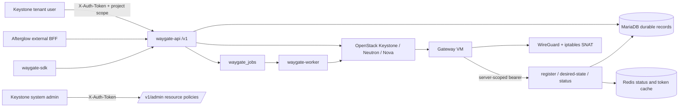

# Waygate Architecture

## Overview

Waygate는 OpenStack 프로젝트별 WireGuard 게이트웨이 VM을 만들고, 게이트웨이 에이전트의 desired state를 관리하며, WireGuard client 설정을 발급하는 독립 서비스다. 서버와 client의 소유권 경계는 Keystone project다. API는 자체 `/v1` 네임스페이스를 제공하고, Afterglow는 필요할 때 외부 BFF로서 이 API를 호출한다. Waygate가 다른 형제 저장소의 private 모듈을 import하지 않는 독립 배포 단위라는 점이 중요하다.

- Repository: [openstack-afterglow/waygate](https://github.com/openstack-afterglow/waygate)
- 분석한 branch: `dev`; 분석한 작업 트리의 소스 기준일은 이 문서 작성 시점이다.
- package versions: root distribution and Python runtime package `waygate` `0.1.3` (`pyproject.toml`, `waygate/__init__.py`); `waygate-sdk` remains `0.1.2` (`sdk/pyproject.toml`). The Kolla role's `waygate_image_tag` remains `0.1.2`, the known published runtime image default. Python `>=3.12`, FastAPI `0.125.0`, Uvicorn `0.39.0`, OpenStack SDK `3.3.0`, Pydantic `2.13.4`, Redis client `5.0.0`.
- 1분 책임 요약: `waygate-api`는 Keystone 인증·project 소유권·API를, `waygate-worker`는 durable provision/delete job을, MariaDB는 정본 레코드와 암호화 자격증명을, Redis는 상태·토큰의 보조 캐시를 소유한다. 실제 WireGuard private key와 NAT 적용은 게이트웨이 VM의 agent가 소유한다.

## Development status

상태와 검증 수준은 서로 다른 축이다. 2026-09-24 로컬(macOS, Python 3.13.12와 3.12.13)에서 직렬 `uv run pytest tests`와 CI 형태 `uv run pytest tests -n 4 --dist worksteal`이 각각 253건(architecture guard 13건, CI 형태 계약 10건 포함)을 통과했다. 실제 OpenStack·MariaDB·Redis·gateway VM/WireGuard 환경은 실행하지 않았다.

| 기능 | Implementation | Verification evidence | Current limit | Source |
|---|---|---|---|---|
| project-scoped server 생성·조회·삭제 요청 | implemented | test-defined | 생성/삭제는 비동기이며 API는 작업 완료를 기다리지 않는다. | [`waygate/api/servers.py`](waygate/api/servers.py), [`waygate/services/jobs.py`](waygate/services/jobs.py) |
| resource policy 선택과 생성 시점 snapshot | implemented | test-defined | 필수 정책이 없거나 실행 scope에서 검증되지 않으면 생성 요청이 실패한다. | [`waygate/services/resource_policies.py`](waygate/services/resource_policies.py), [`waygate/models/orm.py`](waygate/models/orm.py) |
| Nova/Neutron 게이트웨이 VM provisioning | implemented | test-defined | 실제 OpenStack 리소스와 live 배포는 이 문서에서 검증하지 않았다. | [`waygate/services/provisioner.py`](waygate/services/provisioner.py), [`waygate/services/openstack_ops.py`](waygate/services/openstack_ops.py) |
| VM agent register·desired-state·status | implemented | test-defined | agent가 부팅·네트워크·WireGuard 명령을 수행할 수 있어야 하며 status는 캐시가 만료될 수 있다. | [`waygate/api/agent.py`](waygate/api/agent.py), [`waygate/templates/waygate_agent.yaml.j2`](waygate/templates/waygate_agent.yaml.j2) |
| WireGuard client 생성·수정·soft-delete·`.conf` 재다운로드 | implemented | test-defined | client private key는 서버 VM으로 보내지지 않으며 `.conf` 응답은 호출 시 평문이다. | [`waygate/api/clients.py`](waygate/api/clients.py), [`waygate/services/config_render.py`](waygate/services/config_render.py) |
| 추가 네트워크 attach/detach 및 SNAT | partial | test-defined | SNAT만 지원한다. import는 network attachment를 다시 만들지 않는다. | [`waygate/api/attachments.py`](waygate/api/attachments.py), [`waygate/services/network.py`](waygate/services/network.py) |
| export/import migration bundle | partial | test-defined | client 데이터는 옮기지만 network 재연결은 후속 수동 작업이다. | [`waygate/api/migration.py`](waygate/api/migration.py), [`waygate/services/migration.py`](waygate/services/migration.py) |
| admin resource-policy catalog | implemented | test-defined | system-admin Keystone 권한이 필요하다. | [`waygate/api/resource_policies.py`](waygate/api/resource_policies.py), [`waygate/auth.py`](waygate/auth.py) |
| API health/discovery | implemented | test-defined | `/v1/health`는 process-only 응답이며 DB, Redis, OpenStack readiness를 확인하지 않는다. | [`waygate/main.py`](waygate/main.py), [`tests/test_waygate_feature_flag.py`](tests/test_waygate_feature_flag.py) |

## System context



텍스트 흐름은 다음과 같다. 테넌트가 project-scoped Keystone 요청으로 서버를 생성하면 API가 현재 admin resource policy를 OpenStack에서 검증하고 snapshot을 MariaDB의 server/job transaction에 고정한다. worker가 job을 lease하여 Neutron port·security group과 Nova VM을 만들고, VM cloud-init이 자기 WireGuard key를 만든 뒤 server-scoped bearer로 register한다. 이후 VM timer가 `/agent/desired-state`를 폴링하여 peer와 NAT를 적용하고 `/agent/status`로 관측값을 보낸다. Afterglow는 이 API의 외부 BFF일 뿐이고, Drover·Lumen·Palimpsest는 Waygate 내부 상태의 소유자가 아니다.

## Code map

| 경로 | 핵심 심볼 | 책임과 의존 방향 |
|---|---|---|
| [`waygate/main.py`](waygate/main.py) | `app`, `lifespan`, `health` | FastAPI lifespan에서 DB/cache를 열고 닫으며 `/v1` 라우터, discovery, process health를 마운트한다. |
| [`waygate/auth.py`](waygate/auth.py) | `require_token`, `require_admin`, `validate_token`, `get_admin_connection_for_project` | Keystone `X-Auth-Token`을 검증하고 project-scoped OpenStack connection을 만든다. |
| [`waygate/worker.py`](waygate/worker.py) | `serve`, `main` | DB를 초기화한 뒤 `process_one_job()`을 반복하는 독립 worker 프로세스다. |
| [`waygate/api/servers.py`](waygate/api/servers.py) | `create_waygate_server`, `delete_waygate_server_endpoint`, `_merge_status` | project 소유권과 API 응답을 담당하고 resource snapshot을 job enqueue에 넘긴다. |
| [`waygate/api/agent.py`](waygate/api/agent.py) | `_verify_and_bind`, `register_waygate_agent`, `get_desired_state`, `report_waygate_status` | 사용자 JWT가 아닌 server-scoped agent bearer를 검증하고 VM control channel을 제공한다. |
| [`waygate/api/clients.py`](waygate/api/clients.py) | `create_waygate_client`, `download_vpn_client_config` | X25519 client key 생성, 암호화 저장, `.conf` 렌더와 project ownership을 담당한다. |
| [`waygate/api/attachments.py`](waygate/api/attachments.py) | `attach_waygate_network`, `detach_waygate_network` | project-scoped 네트워크 추가 연결과 분리를 노출한다. |
| [`waygate/api/migration.py`](waygate/api/migration.py) | `export_waygate_server`, `import_waygate_server` | passphrase bundle export/import API다. |
| [`waygate/api/resource_policies.py`](waygate/api/resource_policies.py) | `list_resource_policies`, `discover_resource_policy_options`, `update_resource_policy` | system-admin 전역 resource selection 관리 API다. |
| [`waygate/services/jobs.py`](waygate/services/jobs.py) | `enqueue_*_job`, `_claim_one`, `process_one_job` | MariaDB transaction, `SELECT ... FOR UPDATE SKIP LOCKED`, lease, retry와 terminal failure를 구현한다. |
| [`waygate/services/provisioner.py`](waygate/services/provisioner.py) | `provision_waygate_server`, `delete_waygate_server`, `_rollback` | persisted snapshot으로 Nova/Neutron lifecycle을 조정하고 실패 시 best-effort rollback한다. |
| [`waygate/services/store.py`](waygate/services/store.py) | `waygate_db` CRUD | ORM row와 API dict 변환, project filtering, soft-delete, attachment/client 저장을 담당한다. |
| [`waygate/services/agent_auth.py`](waygate/services/agent_auth.py) | `issue_report_token`, `verify_report_token`, `store_status_result` | 암호화된 durable agent token과 Redis token/status cache의 lifecycle을 담당한다. |
| [`waygate/services/config_render.py`](waygate/services/config_render.py) | `render_client_conf`, `render_agent_desired_state`, `render_agent_userdata` | client config, agent JSON, Nova cloud-init userdata를 렌더한다. |
| [`waygate/services/network.py`](waygate/services/network.py) | `attach_network`, `detach_network` | Neutron network/subnet을 확인하고 Nova interface와 attachment row를 연결한다. |
| [`waygate/services/resource_policies.py`](waygate/services/resource_policies.py) | `resolve_policy_snapshot`, `set_policy` | public/community image, public flavor, shared/external network 정책을 발견·검증한다. |
| [`waygate/services/migration.py`](waygate/services/migration.py) | `export_bundle`, `import_bundle` | passphrase wrapping과 client/network bundle 변환을 담당한다. |
| [`waygate/models/orm.py`](waygate/models/orm.py) | `WaygateServer`, `WaygateClient`, `WaygateNetworkAttachment`, `WaygateJob`, `ResourcePolicy` | MariaDB durable schema와 project/server 관계, 상태, 암호문 필드를 정의한다. |
| [`waygate/templates/waygate_agent.yaml.j2`](waygate/templates/waygate_agent.yaml.j2) | register script, reconcile script, systemd timer | VM 안에서 private key를 생성하고 desired-state→WireGuard sync→SNAT→status 보고를 실행한다. |
| [`waygate/migrations/001_baseline.sql`](waygate/migrations/001_baseline.sql) | baseline DDL | 다섯 주요 테이블과 초기 resource policy row를 생성한다. [`waygate/migrations/manifest.txt`](waygate/migrations/manifest.txt)가 checksum을 고정한다. |
| [`sdk/waygate_sdk/proxy.py`](sdk/waygate_sdk/proxy.py) | `Proxy` | OpenStack SDK service proxy로 `/v1/servers`, client, network, migration, admin policy API를 호출한다. |
| [`sdk/waygate_sdk/service.py`](sdk/waygate_sdk/service.py) | `WaygateService` | service type `waygate`, version `1`과 `Proxy`를 SDK에 등록한다. |
| [`deploy/kolla/ansible/roles/waygate/`](deploy/kolla/ansible/roles/waygate/) | Kolla-Ansible role | root `waygate` wheel의 shared-data로 `share/kolla-ansible/ansible/roles/waygate`에 설치된다. Kolla-Ansible은 이 distribution의 의존성이 아니다. |

의존 방향은 `api → services → db/ORM 또는 OpenStack`이고, `worker → services`다. `sdk`는 HTTP API client이며 서버 runtime의 내부 모듈을 import하지 않는다.

## Runtime flows

### 서버 생성, agent handoff, 상태

1. `POST /v1/servers`의 `require_token`이 `X-Auth-Token`을 Keystone에 검증하고 project를 결정한다.
2. `resolve_policy_snapshot()`이 `waygate.provider_network`, `waygate.image`, `waygate.flavor`를 현재 execution scope에서 재검증하고 선택적으로 `waygate.floating_network`을 읽는다.
3. `enqueue_provision_job()`은 `WaygateServer(status=CREATING, resource_policy_snapshot=...)`와 `WaygateJob(kind=provision,status=queued)`를 한 MariaDB transaction에 기록한 뒤 201을 반환한다.
4. `waygate-worker`의 `_claim_one()`은 queued 또는 900초 이상 stale running job을 `SKIP LOCKED`로 lease한다. `process_one_job()`은 최대 3회 시도하며 실패하면 재queue하거나 server/job을 failed로 만든다.
5. `provision_waygate_server()`는 provider port, UDP ingress security group, server-scoped encrypted bearer, Nova VM을 만든다. VM이 ACTIVE가 되면 FIP 또는 fixed IP를 기록하고 `PROVISIONING`으로 남겨 register를 기다린다.
6. cloud-init register script는 VM 안에서 `/etc/wireguard/privatekey`와 public key를 최초 1회 생성하고 `/agent/register`로 public key를 보낸다. 백엔드는 server 경로에 귀속된 bearer를 비교한 뒤 CREATING/PROVISIONING을 ACTIVE로 전환한다.
7. systemd timer가 부팅 20초 후 시작하고 기본 15초 간격으로 reconcile한다. `/agent/desired-state`의 enabled peer와 `nat_networks`를 받아 `wg syncconf`와 SNAT를 실행하고, `wg show` 결과를 `/agent/status`로 보낸다. status는 Redis에 5분 TTL로 저장되어 API 응답의 최신 peer count/handshake 보조 정보가 된다.
8. 삭제는 `DELETE /v1/servers/{server_id}`에서 server를 `DELETING`으로 바꾸고 중복 active delete job을 막는다. worker가 FIP/VM/provider port와 agent token을 정리한 뒤 DB row를 soft-delete한다. 삭제 API는 202만 반환하고 client-observable `DELETED` event를 약속하지 않는다.

### Client와 config

`POST /v1/servers/{server_id}/clients`는 ACTIVE이고 등록된 server public key가 있는 경우에만 실행된다. API가 X25519 private/public key를 만들고 private key와 optional preshared key를 AES-GCM 암호문으로 MariaDB에 저장하며 tunnel IP를 IPAM/unique constraint로 할당한다. 응답의 `tunnel_conf`는 그 호출 시에만 생성되는 값이 아니라 저장된 암호문을 기준으로 다시 생성할 수 있는 설정이다. `GET .../config`는 같은 project의 client를 조회하고 private key를 복호화하여 `AllowedIPs`에 client route와 active attachment CIDR을 합친 plain-text WireGuard config를 반환한다. 서버 VM에는 client private key를 전송하지 않고 public key와 preshared key만 desired state에 포함한다.

### 네트워크 attach/detach

`POST /v1/servers/{server_id}/networks`는 ACTIVE VM과 project-owned 또는 명시적으로 shared/external인 network를 확인하고 첫 IPv4 또는 지정 subnet의 CIDR을 기록한다. `waygate_network.attach_network()`이 `nova.attach_interface`로 VM에 port를 붙인 뒤 `WaygateNetworkAttachment(status=ACTIVE, port_id, cidr)`를 저장한다. 에이전트의 다음 reconcile에서 이 CIDR을 `nat_networks`로 받아 tunnel source를 해당 NIC로 `MASQUERADE`한다. `DELETE .../networks/{attachment_id}`는 interface detach를 best-effort로 시도하고 attachment row를 삭제한다. VM/network가 이미 사라져도 DB 정리는 진행될 수 있다.

### Export/import

`POST .../export`는 client와 network attachment를 passphrase 기반 `scrypt`/AES-GCM bundle로 만든다. `POST .../import`는 대상 server에 client를 재생성하고 충돌/잘못된 항목은 결과의 `skipped`로 돌려줄 수 있다. import는 client의 key 보존을 목표로 하지만 network attachment를 재생성하지 않는다. 네트워크는 대상 환경에서 별도 attach가 필요하다.

## Data and contracts

### Authoritative storage와 cache split

| 데이터 | 정본 | 보조 cache/전송 | 불변식 |
|---|---|---|---|
| server 상태와 OpenStack IDs | MariaDB `waygate_servers` | Redis status 결과를 API view에 merge | `project_id` 필터를 통과한 caller만 server를 읽는다. |
| client metadata와 암호화된 client/preshared key | MariaDB `waygate_clients` | 없음 | 활성 server 내 `name`, `tunnel_ip` unique constraint를 지키며 soft-delete 시 슬롯을 비운다. |
| 네트워크 attachment 및 CIDR | MariaDB `waygate_network_attachments` | 없음 | active attachment만 desired-state의 `nat_networks`가 된다. |
| provision/delete job | MariaDB `waygate_jobs` | worker memory lease | 같은 server에 신선한 running job을 중복 실행하지 않고, lease 만료 후에만 reclaim한다. |
| admin resource selection | MariaDB `resource_policies` | 생성 시 server JSON snapshot | 실행 시점의 선택을 snapshot에 고정하고 OpenStack scope에서 다시 검증한다. |
| agent bearer token | MariaDB `agent_token_encrypted` 암호문 | Redis `afterglow:waygate:srvtoken:*`, TTL 7일 | Redis eviction/재시작 후 DB에서 복원하며 server 삭제/재발급 시 양쪽을 폐기한다. |
| agent `wg show` 보고 | 없음(관측 cache) | Redis `afterglow:waygate:status:*`, TTL 5분 | cache miss는 status를 모르는 상태이며 durable server 상태를 바꾸지 않는다. |
| WireGuard server private key | Gateway VM `/etc/wireguard/privatekey` | 백엔드/DB로 전송하지 않음 | VM 내부에서 최초 생성·재부팅 재사용한다. |

암호화 키는 `waygate.encryption_key` 64 hexadecimal characters 설정으로 검증되며 실제 값은 문서나 로그에 기록하지 않는다. `WaygateServer.key_name` 컬럼은 존재하지만 현재 provisioning의 `create_server` 인자에는 사용되지 않는다.

### API와 SDK contract

- Standalone API는 `waygate/main.py`에서 server/client/attachment/migration/agent 라우터를 `/v1/servers` 아래, admin policy 라우터를 `/v1/admin` 아래에 마운트한다. `/`, `/v1/`, `/v1/health`는 인증 없이 discovery/health를 제공한다.
- 사용자 경로는 `X-Auth-Token`과 project-scoped Keystone token을 요구한다. resource policy API는 추가로 system-scoped `admin` role assignment를 요구한다. 소유권 불일치 server는 정보 노출을 막기 위해 같은 404로 응답한다.
- 생성은 201과 CREATING server를, 삭제 요청은 202와 `{"ok": true, "status": "DELETING"}`를 반환한다. agent register/status는 204, desired-state는 JSON peer/NAT payload, config는 `text/plain`이다.
- `WaygateServerStatus`는 `CREATING`, `PROVISIONING`, `ACTIVE`, `DELETING`, `DELETED`, `ERROR`; attachment status는 `CREATING`, `ACTIVE`, `ERROR`, `DELETING`, `DELETED`; NAT mode는 현재 `snat`만 허용한다.
- [`sdk/waygate_sdk/proxy.py`](sdk/waygate_sdk/proxy.py)의 `Proxy`는 서버 CRUD, client/config, network attach/detach, export/import, policy catalog/update, health를 URL-safe 단일 path segment로 호출한다. SDK의 service type은 `waygate`, supported version은 `1`이다.

## Deployment and operations

### 프로세스와 이미지

`docker/Dockerfile`은 `waygate-runtime`을 만든 뒤 `waygate-api`와 `waygate-worker` target으로 나눈다. Builder는 root package의 `service` extra만 설치하므로 role-only wheel 소비자는 service runtime이나 Kolla-Ansible을 받지 않는다. API는 `uvicorn waygate.main:app --host 0.0.0.0 --port 8010`, worker는 `python -m waygate.worker`로 시작한다. `pyproject.toml`의 console scripts는 `waygate-api`, `waygate-worker`, `waygate-migrate`, `waygate-cutover`를 제공한다. SDK는 `sdk/` 아래 별도 package와 별도 `uv.lock`을 가진다.

설정은 `WAYGATE_CONFIG_FILE`이 지정한 TOML 또는 후보 `waygate.conf`에서 읽고, environment가 우선한다. 주요 섹션은 `[keystone]`/`[openstack]`, `[database]`, `[cache]`, `[waygate]`이며 callback base URL, 기본 tunnel CIDR `10.8.0.0/24`, 기본 listen port `51820`, encryption key, trusted proxies를 포함한다. API와 worker 모두 `database.url`이 필요하다. Redis 기본 URL은 `redis://localhost:6379/6`이다.

### Bootstrap, migration, health, 관측

- 새/기존 MariaDB에는 [`waygate/migrations/manifest.txt`](waygate/migrations/manifest.txt)의 checksum-verified `001_baseline`을 적용한다. 적용 명령은 `uv run waygate-migrate --apply`이며, `--database-url`로 설정을 명시할 수 있다.
- migration runner는 `schema_migrations` ledger에 logical ID/path/SHA-256/applied time을 기록하며 적용된 identity가 변하면 실패한다. DB schema가 먼저 준비되지 않으면 API/worker는 정상 동작하지 않는다.
- `/v1/health`의 `{"status":"ok"}`는 프로세스 route가 응답한다는 뜻뿐이다. DB·Redis·Keystone·Neutron·Nova 연결 readiness나 agent 상태를 확인하지 않는다.
- API/worker Python logging은 stdout/stderr로 수집할 수 있고, cloud-init register/reconcile agent는 `/var/log/waygate-agent.log`와 systemd journal에 기록한다. 운영자는 server status와 Redis의 최근 status report를 함께 확인해야 한다.
- [`.github/workflows/ci.yml`](.github/workflows/ci.yml)(`CI`)은 `pull_request`(main, dev)와 `workflow_call`로만 실행되며 `push` trigger가 없다. `service` job은 checkout 뒤 첫 step으로 architecture check를 하고 `uv sync --extra service --extra dev --frozen`, `uv run pytest tests -n 4 --dist worksteal`(dev extra의 pytest-xdist, public `ubuntu-latest` 4 vCPU에 맞춘 고정 워커 수), `uv run ruff check .`을 수행한다. SDK job은 `sdk/` working directory에서 별도 dependency/test/lint를 수행한다. 두 job 사이에 `needs`는 없다.
- [`.github/workflows/docker-build.yml`](.github/workflows/docker-build.yml)(`Docker Build & Push`)은 push(main, dev), tag `v*`, `pull_request`(main, dev), `workflow_dispatch`로 실행된다. push/tag/dispatch에서는 `test` job이 `ci.yml`을 호출하는 SHA당 유일한 테스트 실행이고, `build-and-push`는 `needs: test`와 `needs.test.result == 'success'`일 때만 API/worker 이미지를 빌드해 GHCR에 push한다. pull_request에서는 CI 자체의 pull_request run이 같은 merge ref에서 같은 `ci.yml`을 실행하므로 `test` job을 건너뛰고, 이미지 빌드는 테스트를 기다리지 않고 실행하되 push하지 않는다(`push: ${{ github.event_name != 'pull_request' }}`). 따라서 push commit의 check 이름은 `Docker Build & Push / test / ...`이고, PR에는 `CI / ...` check와 no-push 이미지 빌드 check가 붙는다.
- [`tests/test_ci_workflow_contract.py`](tests/test_ci_workflow_contract.py)가 trigger 집합, 두 워크플로우의 `pull_request` 설정 동일성, dedup `if:`, 빌드 게이팅 식, PR 빌드 no-push, xdist 워커 수, 직렬 entrypoint 유지, `ubuntu-latest` 전용 runner를 고정한다. CI 성능 규정과 기록된 기준 수치는 [`AGENTS.md`](AGENTS.md)의 `CI 파이프라인 성능 규정`에 있다.

## Security boundaries

| 주체/경계 | 자격증명과 권한 | 보호 규칙 |
|---|---|---|
| 테넌트 사용자 | Keystone project-scoped token in `X-Auth-Token` | `require_token`이 token을 검증하고 모든 server/client/attachment 조회에 project ownership을 적용한다. |
| system administrator | Keystone token + system-scope `admin` role assignment | `require_admin`만 전역 `resource_policies`를 읽고 쓸 수 있다. tenant admin은 global policy를 변경할 수 없다. |
| Gateway VM agent | 서버별 bootstrap bearer | `/agent/register`, `/agent/desired-state`, `/agent/status`는 경로의 `server_id`와 bearer를 timing-safe 비교하고 불일치 시 fail-closed 401을 반환한다. |
| anonymous health/discovery | 별도 자격증명 없음 | `/`, `/v1/`, `/v1/health`는 process 정보만 노출하며 tenant data를 반환하지 않는다. |
| OpenStack control plane | Waygate service/admin password 설정으로 project connection | `get_admin_connection_for_project()`이 요청 project로 connection을 만들며 실제 credential은 소스 문서에 기록하지 않는다. |

백엔드 DB에는 `agent_token_encrypted`, client private/preshared key 암호문만 저장하고, WireGuard server private key는 VM에서 생성되어 백엔드로 되돌아오지 않는다. client config 다운로드는 의도적으로 해당 client private key를 평문으로 반환하므로 인증된 소유권 검사를 우회해 외부 BFF나 로그에 흘리지 않아야 한다. VM bearer는 Redis에 평문 cache가 있을 수 있으나 durable 원천은 암호화된 MariaDB 값이며 토큰 자체를 이 문서에 기록하지 않는다. migration export는 passphrase로 다시 래핑되고 API 응답은 `Cache-Control: no-store`다.

## Development and verification

2026-09-24 로컬(macOS, Python 3.13.12와 3.12.13)에서 `uv run pytest tests`와 `uv run pytest tests -n 4 --dist worksteal`이 각각 253건을 통과했다(직렬 약 9.3초, 4 워커 약 4.0초의 로컬 측정이며 CI 측정값이 아니다). focused boundary 98건, Kolla assets 5건, `uv run ruff check .`, SDK 21건과 SDK lint도 통과했다. 아래 SDK와 실제 OpenStack/MariaDB/Redis/VM 경계는 별도 전제이며 실행하지 않은 계층을 통과로 표시하지 않는다.

### Waygate service

```sh
uv sync --extra service --extra dev --frozen
uv run pytest tests/test_kolla_assets.py -q
uv run pytest tests/test_waygate_jobs.py tests/test_waygate_provisioner.py tests/test_waygate_agent.py tests/test_waygate_clients.py tests/test_waygate_network.py -q
uv run pytest tests
uv run pytest tests -n 4 --dist worksteal
uv run pytest tests/test_ci_workflow_contract.py -q
uv run ruff check .
```

직렬 `uv run pytest tests`가 기본 entrypoint이고, CI는 같은 테스트를 pytest-xdist 4 워커로 실행한다. xdist 옵션은 `pyproject.toml`의 `addopts`가 아니라 `ci.yml`에만 있으므로 두 명령은 같은 테스트 수를 수집해야 한다. `tests/test_waygate_jobs.py`는 transaction/lease/retry/중복 delete를, `tests/test_waygate_provisioner.py`는 persisted policy snapshot과 VM userdata를, `tests/test_waygate_agent.py`는 bearer fail-closed/register/desired-state/status와 token durability를, `tests/test_waygate_clients.py`는 key/config/project ownership/IPAM을, `tests/test_waygate_network.py`는 attach/detach/SNAT contract를 정의한다. `tests/test_waygate_openapi.py`, `tests/test_waygate_feature_flag.py`, `tests/test_waygate_security.py`, `tests/test_waygate_migration.py`, `tests/test_migrations.py`는 discovery/security/migration/schema 경계를 추가로 정의한다. 실제 OpenStack, MariaDB, Redis, VM timer, WireGuard, KVM 실행은 별도 운영 전제조건이다.

### SDK

```sh
cd sdk
uv sync --all-extras --frozen
uv run pytest
uv run ruff check .
```

SDK 테스트는 [`sdk/tests/test_proxy.py`](sdk/tests/test_proxy.py)에서 HTTP method/path/body, path escaping, plain-text client config, service registration을 검증한다. 이는 서버 API와의 호출 contract를 정의하지만 실제 endpoint live availability를 증명하지 않는다.

### Schema, architecture, migration

```sh
uv run waygate-migrate --database-url "$WAYGATE_DATABASE_URL" --apply
python3 scripts/check_architecture.py
python3 scripts/check_architecture.py --staged
```

첫 명령은 실제 MariaDB URL과 migration 권한이 필요하다. 마지막 두 명령은 canonical architecture guard가 vendor된 뒤 각각 working tree와 index snapshot을 검사한다. check는 source digest와 문서 review marker의 일치를 확인하며, `--staged`에서는 staged source와 staged `ARCHITECTURE.md`를 함께 검사한다.

## Change guide

| 변경 | 먼저 읽을 곳 | 같은 변경에서 갱신할 계약/검증/문서 |
|---|---|---|
| server API/status 또는 project ownership | [`waygate/api/servers.py`](waygate/api/servers.py), [`waygate/auth.py`](waygate/auth.py), [`waygate/models/schemas.py`](waygate/models/schemas.py) | 이 문서의 status/API/security/runtime flow, 관련 `tests/test_waygate_*` |
| durable job/lease/retry | [`waygate/services/jobs.py`](waygate/services/jobs.py), [`waygate/models/orm.py`](waygate/models/orm.py) | transaction 불변식과 `tests/test_waygate_jobs.py`, migration 필요 여부 |
| Nova/Neutron provisioning/delete | [`waygate/services/provisioner.py`](waygate/services/provisioner.py), [`waygate/services/openstack_ops.py`](waygate/services/openstack_ops.py) | OpenStack resource flow/rollback/limit, `tests/test_waygate_provisioner.py` |
| agent bearer/desired-state/reconcile | [`waygate/api/agent.py`](waygate/api/agent.py), [`waygate/services/agent_auth.py`](waygate/services/agent_auth.py), [`waygate/templates/waygate_agent.yaml.j2`](waygate/templates/waygate_agent.yaml.j2) | bearer trust boundary, timer/NAT flow, `tests/test_waygate_agent.py` |
| client keys/config/IPAM | [`waygate/api/clients.py`](waygate/api/clients.py), [`waygate/services/config_render.py`](waygate/services/config_render.py), [`waygate/services/keys.py`](waygate/services/keys.py) | encrypted storage/config contract, `tests/test_waygate_clients.py`, `tests/test_waygate_crypto.py` |
| network attachment/NAT | [`waygate/api/attachments.py`](waygate/api/attachments.py), [`waygate/services/network.py`](waygate/services/network.py) | attachment state/CIDR/SNAT limits, `tests/test_waygate_network.py` |
| resource policy 또는 server snapshot | [`waygate/services/resource_policies.py`](waygate/services/resource_policies.py), [`waygate/api/resource_policies.py`](waygate/api/resource_policies.py) | policy keys/constraints/snapshot 설명, `tests/test_waygate_provisioner.py` |
| migration/export/import | [`waygate/api/migration.py`](waygate/api/migration.py), [`waygate/services/migration.py`](waygate/services/migration.py) | bundle/key/network recreation limit, `tests/test_waygate_migration.py` |
| ORM/migration/config/deployment/CI | [`waygate/models/orm.py`](waygate/models/orm.py), [`waygate/migrations/`](waygate/migrations/), [`waygate/config.py`](waygate/config.py), [`docker/Dockerfile`](docker/Dockerfile), [`.github/workflows/ci.yml`](.github/workflows/ci.yml), [`.github/workflows/docker-build.yml`](.github/workflows/docker-build.yml), [`AGENTS.md`](AGENTS.md)의 CI 파이프라인 성능 규정 | schema/operations/verification sections와 migration ledger, CI/architecture hook, [`tests/test_ci_workflow_contract.py`](tests/test_ci_workflow_contract.py), `actionlint`, CI 전후 실측 |
| SDK path/method | [`sdk/waygate_sdk/proxy.py`](sdk/waygate_sdk/proxy.py), [`sdk/waygate_sdk/service.py`](sdk/waygate_sdk/service.py) | SDK contract와 [`sdk/tests/test_proxy.py`](sdk/tests/test_proxy.py) |
| bugfix/refactor with no topology change | 실제 변경 source와 영향받은 test | 구조 영향이 없다는 이유를 Maintenance review summary에 남기고 source digest를 다시 stamp한다. |

## Maintenance

Architecture maintenance는 문서만 고치는 별도 작업이 아니라 source 변경과 같은 change의 계약이다.

1. 작업 전에 이 root `ARCHITECTURE.md`와 변경된 영역의 상세 문서·테스트·manifest·CI를 읽는다.
2. code/config/schema/dependency/deploy/test가 바뀌면 영향받는 본문, source-linked code map, 상세 문서와 검증 명령을 같은 변경에서 갱신한다. 구조 영향이 없는 bugfix/refactor도 그 이유를 최신 review summary에 기록한다.
3. 계획·roadmap·기존 설명보다 현재 source와 tests가 우선한다. 구현되지 않은 경로를 implemented로 승격하지 않고, test-defined를 test-passed로 승격하지 않는다.
4. source를 다시 검토한 뒤 working tree 또는 제출할 index 기준으로 stamp한다. 자동 stage/commit은 하지 않는다.
5. 문서와 의도된 source 변경이 모두 끝난 뒤 아래 check를 실행하고, 실패하면 commit/PR을 완료하지 않는다.

```sh
python3 scripts/check_architecture.py --stamp --summary "검토한 변경 경로와 구조 영향 또는 영향 없음의 이유"
python3 scripts/check_architecture.py
python3 scripts/check_architecture.py --staged
```

`--staged` 제출을 사용할 때는 먼저 의도한 source와 `ARCHITECTURE.md`만 stage하고 `python3 scripts/check_architecture.py --stamp --staged --summary "..."`로 index source 기준 marker를 갱신한 다음 문서를 stage하여 재검사한다. pre-commit hook은 선택적으로 `pre-commit install`로 설치할 수 있지만 직접 check 명령도 항상 사용할 수 있어야 한다. 실제 credential, token, private key, password는 architecture나 review summary에 넣지 않는다.

<!-- architecture-review:start -->
```json
{
  "schema_version": 1,
  "source_sha256": "bc2d1ccad3bd785a08cdcf6116d4f9b830d9620095d173a06dde9baaf65d6d0a",
  "reviewed_at": "2026-09-23T19:06:41Z",
  "summary": "CI performance: reviewed .github/workflows/ci.yml, .github/workflows/docker-build.yml, pyproject.toml, uv.lock, tests/conftest.py, tests/test_architecture_guard.py, scripts/check_architecture.py, docker/Dockerfile, AGENTS.md. ci.yml drops the push trigger (pull_request + workflow_call only) and runs service pytest with pytest-xdist -n 4 --dist worksteal; docker-build.yml skips the duplicate test job on pull_request and gates build-and-push on needs.test success (PR builds never push). Adds pytest-xdist to the dev extra (lock adds only pytest-xdist 3.8.0 and execnet 2.1.2), tests/test_ci_workflow_contract.py, and the AGENTS.md CI performance rules with the measured baseline. No runtime, API, schema, image content or deployment topology change; Deployment and operations CI bullets, verification commands and change guide updated."
}
```
<!-- architecture-review:end -->

## Glossary

- **Agent**: Gateway VM 안에서 register, desired-state polling, WireGuard sync, SNAT, status 보고를 수행하는 cloud-init/systemd 구성.
- **BFF**: Backend-for-Frontend. Afterglow가 외부 사용자 표면에서 Waygate standalone API를 호출할 수 있지만 Waygate 내부 상태를 소유하지는 않는다.
- **FIP**: OpenStack Floating IP. 있으면 gateway endpoint로 기록하고 삭제 시 VM보다 먼저 정리한다.
- **Gateway VM**: 테넌트 project에 부팅되는 OpenStack Nova server. WireGuard server private key를 VM 내부에 보관한다.
- **Lease**: worker가 `WaygateJob`을 running으로 claim한 시간. 900초 후 stale이면 다른 worker가 reclaim할 수 있다.
- **NAT/SNAT**: 현재 지원하는 source masquerade. agent가 `nat_networks` CIDR별 outbound NIC에 iptables `MASQUERADE`를 적용한다.
- **Policy snapshot**: 생성 요청 당시 `resource_policies`에서 resolve한 image/flavor/network ID와 name의 server JSON 복사본.
- **Project ownership**: Keystone project ID를 server/client/attachment 조회와 변경의 경계로 사용하는 규칙.
- **Soft-delete**: `deleted_at`, actor, reason을 남기고 API 조회에서 제외하는 삭제 방식. client-observable `DELETED` event와 동일하지 않다.
- **WireGuard peer**: Waygate client 하나. backend는 private key를 암호화 보관하고 gateway agent에는 public/preshared material만 전달한다.
